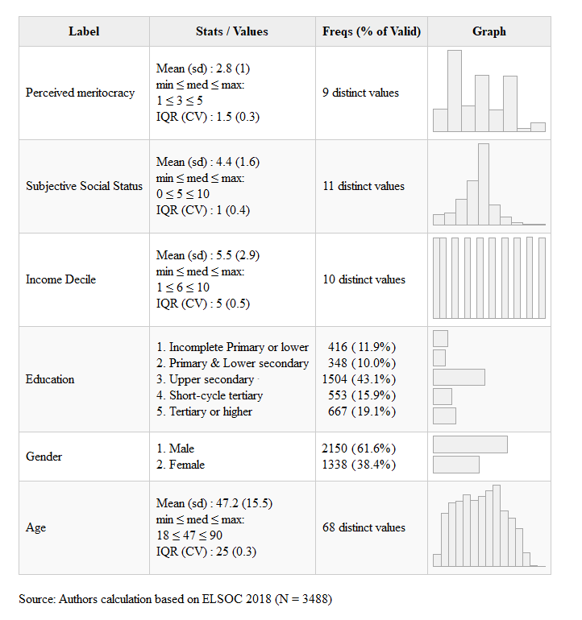

```{r render,include=FALSE, eval=FALSE}
 rmarkdown::render("paper-eng.Rmd")
```

```{r setup, include=FALSE}
 knitr::opts_chunk$set(
 	echo = FALSE,
 	message = FALSE,
 	warning = FALSE,
 	cache = TRUE,
 	fig.align = 'center'
 )
 options(scipen=999)
 rm(list=ls())
 options(knitr.kable.NA = '')
```

# Introduction

During the last decades, the rise of economic inequality [@piketty_capital_2014] and the stagnation of social mobility [@oecd_broken_2018] has increased the attention of social scientists on how societies perceive the functioning of meritocratic rules - that efforts and talents are rewarded - and its role in economic inequality justification [@mijs_meritocracy_2020]. Meritocracy has been related to the justification of social inequalities, as individual achievements and location in the class structure are mostly attributed to individual agency rather than structural constraints [@frei_fruto_2018]. In this regard, the literature  has suggested that individuals' views about the labour market create an image of labour relations and how economic resources are distributed [@Svallfors2006]. Furthermore, empirical evidence has shown that belonging to non-manual and professional social classes is negatively associated with perceived meritocracy, which is more salient in societies with higher levels of economic inequality and low social class mobility [@Canales2015lse]. 

Social stratification can be studied from different approaches. On the one hand, studies on objective social stratification have analysed how objective social inequality is expressed in  economic and cultural resources [@Kerbo2003], usually associated with the concept of social class. On the other hand, @Kluegel-Smith1986 point out that studying social inequality from a subjective standpoint takes into account elements of individual experience in the class structure. The concepts of class and status have been crucial for studying social inequality from the social sciences [@Ridgeway2014]. Whereas class analysis mainly focuses on occupations, structural position in the labour market and levels of authority and control over work [@Erikson1992], status is understood as a structure of relationships perceived as superior, equitable, or inferior among individuals [@Chan2007]. 

In sociology, the concept of class is proximate to occupational class schemes, but also it has been linked to variables such as income and education. Regarding subjective aspects, although there are scales of subjective social class [@Elbert2018], research on subjective social status has been developed more [@zhou_trajectory_2021]. In this respect, it has been shown that the perception of an individual or group's standing in the social hierarchy compared to a reference group, such as society [@Evans2004] or their local communities [@condon_economic_2020] can also explain perceptions about meritocracy [@Castillo2018]. It has been stated that individuals are likely to compare themselves with people or groups perceived as similar, contributing to diminishing cognitive dissonance and seeking to assemble better estimations about their societal position [@Merton1968;@festinger1954theory]. Whereas empirical evidence has shown a persistent middle-class bias toward the center of the social hierarchy, where high-status individuals underestimate their position while low-status individuals overestimate it [@Cruces2011]. At this point, the literature has suggested that the characteristics of the closest reference groups shape subjective estimations, in which images of society are influenced by the homophily of their close networks [@Evans2017 ]. Thus, higher subjective social status is expected to be associated with higher perceived meritocracy and also positively moderate the influence of class and status [@hvidberg_social_2020]. 

This study aims to understand how objective class and status influence meritocracy
perception. In addition, it discusses the role of subjective social status and how it interacts with social class, education and income.

## Meritocracy perception

First, _merit_ is understood as the combination of an individual's effort and ability [@Sen2000]. Second, the meritocratic ideal assumes that status achievement is not constrained by the distribution of opportunities in society [@mccall_exposure_2017]. Both constitute the substantive core of how meritocracy can be understood. Nevertheless,  studies have paid little attention to the construct measurement of concepts related to meritocracy, and low empirical precision is often noticed due to the indistinct use of descriptive and normative dimensions [@Castilloetal2019]. 

For instance, studies on meritocracy have made undifferentiated use of concepts such as *Meritocratic Beliefs* [@Kunovich2007; @McCoy2007; @Ellis2017; @mijs_how_2021a; @bernardo_meritocracy_2021], *Meritocratic Ideals*, [@Reynolds2014] or *Perceived Meritocracy* [@Xian2017], which constitutes a difficulty to empirically assess the role of social status on the perception of meritocracy. This lack of distinction in the literature suggests considering a more accurate definition of the construct. Furthermore, this would lead to more precise inferences and better evidence regarding the empirical study of the subjective aspects of meritocracy [@Castilloetal2019]. 

Regarding the perception and preferences distinction, @Aalberg2003 defines _perception_ as the subjective estimation of an external object depicted by individuals. Therefore, the descriptive (*how is*) dimension does not consider the normative evaluation of the object (*should be*). On the other hand, @druckman_preference_2000 define the normative dimension as the expression of preferences, understood as evaluating an external object based on previous experience and information. In addition, @Feldman2001 suggests that preferences are also driven by the structure and internalisation of norms and values [@Kulin2013]. On the other side, when we talk about meritocracy perception the descriptive dimension is addressed, referring to "how meritocracy is" rather than "how it should be". In this line, @Garcia2001 posits that meritocracy perception corresponds to the degree to which individuals consider that their society complies with the principles of a meritocracy. In other words, how individuals perceive to what extent society allocates rewards (e.g. wages or jobs) based on effort and talent. 

## Status, Class and meritocracy perception

### Status 
The evidence on the association of social status with meritocracy follows the general assumption that individuals with higher social status have a higher meritocracy perception. From a self-interest approach [@Meltzer81] it is possible to argue that individuals who belong to the higher strata of the income distribution have a favourable perception of meritocracy to the extent that they have accumulated economic resources as a result of their effort and talent. In this line, empirical evidence suggests that higher status positions are related to lower inequality perception [@Evans2017] and the highest justification of economic inequality [@Trump2017; @Jasso2015]. Regarding meritocracy, the core assumption is that merit explains status achievement. In this sense, if higher perceived equity is related to structural opportunities to get ahead, it is reasonable to argue that meritocracy constitutes the central mechanism for justifying differences in social status [@McCoy2007].

Evidence suggests a positive relationship between income and perceptions of meritocracy regarding the importance of individual merit in getting ahead in life [@Reynolds2014; @Xian2017], as well as what extent individuals perceive intelligence and skills are rewarded [@Castilloetal2019; @Duru-bellat2012]. Nevertheless, there is mixed evidence regarding how lower-income individuals rationalise inequality and meritocracy. On the one hand, @Newman2015 shows proof in favour of the *activated conflict theory* demonstrating the poor hold lower beliefs in meritocracy in unequal localities, arguing economically heterogeneous contexts induce social comparisons leading to higher awareness about social status. On the other hand, following the *relative power theory*, @Solt2016 challenged the previous evidence showing the poor in unequal contexts to strongly support meritocracy. The authors suggest the rich hold higher power due to income and wealth concentration, allowing them to disseminate legitimising ideas about economic inequality. In this context, the poor are less critical towards dominant beliefs like meritocracy, but it also serves as a psychological mechanism for resilience deprivation [@Solt2016,p.4]. On top of this debate, @morris_paradox_2022 findings show firmer meritocracy beliefs among low-income individuals in highly unequal contexts, but the differences tend to fade as inequality declines.         

Based on a material self-interest approach is possible to argue that individuals with higher economic resources attribute more importance to merit and therefore perceive rewards in society are distributed according to it, which leads us to establish: 

> $H_{\text{1a}}$: the position in the income distribution is positively associated with perceived meritocracy.

In the same way, income reflects an individual's economic resources, the study of meritocracy concerning educational attainment has been mainly addressed by studies on social stratification [@Goldthorpe2003]. Studies on meritocracy perception have discussed two theoretical approaches. On the one hand, the *reproductionist* approach [@Bourdieu2009; @bernstein_class_2003] supports the *socialisation* hypothesis. The argument suggests school socialisation operates as a normative reinforcement of meritocratic ideals, then educated individuals are more willing to support merit as the main mechanism for legitimising inequality [@Lampert2013]. On the other hand, the *instruction* hypothesis suggests that perceived meritocracy tend to weaken in individuals with higher educational attainment because they would be more aware of the influence of structural factors on status achievement [@Duru-bellat2012; @Schneider2015] taking into account educational mobility expriences [@Canales2015lse] and the increasing chances to engage with more complex political ideas [@bubak_perceptions_2019].

Empirical evidence provides support for both approaches. However, it should be noted that these results can be attributed to differences in the measurement of perceived meritocracy. On the one hand, studies report evidence in favour of the socialisation hypothesis have pointed out that greater educational attainment is associated with greater attributed importance of individual factors in getting ahead in life [@Xian2017; @Reynolds2014; @mijs_paradox_2021], as well as determining the attainment of a better salary [@Kunovich2007]. On the other hand, evidence in favour of the instruction hypothesis shows that individuals with higher educational attainment strongly disagree that people are rewarded for their effort and talent [@Duru-bellat2012; @Castilloetal2019]. Additionally, the argument of the instructional hypothesis can be complemented by the fact that individuals with greater awareness of inequality may experience feelings of injustice and relative deprivation since individuals with the same educational attainment have access to unequal rewards [@Adams1965; @Smith-eta2020_relative-deprivation]. In this sense, it has been shown that individuals with higher educational attainment are those who perceive greater wage inequality [@Castillo2012a_justice]. If perceived meritocracy is understood as " the perception society is based on the principles of meritocracy" [@Garcia2001], it corresponds to the descriptive appraisals of the link between merit and rewards. Then, we can argue that: 

> $H_{\text{1b}}$: educational attainment is negatively associated with perceived meritocracy.

### Class 

The relationship between structural position and meritocracy has mainly focused on income and educational attainment, setting social class aside from the discussion. However, it has been shown that occupation represents a characteristic that synthesises educational attainment and income level [@Ganzeboom1992], therefore is considered one of the main status symbols in contemporary societies [@Chan2004; @Chan2007]. Furthermore, studies on social mobility have shown the relevance of studying social inequality through class schemes because they take into account the occupation, autonomy and authority in the workspace to classify individuals, which comprise a substantive distinction [@Erikson1992; @Erikson2002]. In this sense, evidence on social stratification suggests that occupation-based class schemes assume that individuals are similar in terms of their structural position in the labour market and levels of authority and control over work [@Connelly2016]. However, @Chan2004 argue that common characteristics do not preclude the possibility of heterogeneity within classes, for instance, in terms of cultural consumption behaviour and political preferences [@Chan2007].

The literature on distributive preferences has suggested social class reflects individuals' experience in the labour market regarding job opportunities and wages [@Svallfors2006]. In a similar vein, @Kulin2013 demonstrated lower classes being exposed to higher labour market risks, such as the likelihood of job loss and lower wages, led individuals in material deprivation and risk exposure, to demand more redistribution [@rehm_risks_2009]. In this framework, lower risk exposure driven by advantageous labour market positions held by higher classes is associated with lower redistributive preferences and higher perceived meritocracy. 

In line with the previous argument, little evidence of the role of social class on meritocracy perception has been shown by the literature. For instance, @Smith2012 found that belonging to the emerging petty bourgeoisie is associated with higher levels of perceived meritocracy when compared to wage earners. These results align with the findings of @Sandoval2017, where skilled and service workers, compared to unskilled workers, attribute higher importance to effort to get ahead in life. However, a study on the relationship between social mobility and perceived meritocracy in Chile demonstrated that upward-mobile individuals towards the service class are less likely to consider that merit is rewarded [@Canales2015lse].

Social stratification research in Chile has shown regardless of the high-income inequality, social mobility is still high, mainly due to mobile individuals from lower-class origins to non-manual and service-class destinations [@Torche2005a]. However, regardless of the changes in the social structure, evidence shows that wages have remain relative stagnated and disposable income distribution has remained stable [@EspinozaNunez2014]. Additionally, during the last decades, the size of the middle class has grown driven by the increasing number of professional and technical occupations generated by tertiary education expansion [@Mclure_etal2014]. Nevertheless, this rise of human capital caused an increment in average wages but has not significantly altered market income inequality. In this line, a study on the cohort of individuals that joined the labour market from 1990 onwards, showed the expected positive returns of tertiary education on wages. Nevertheless, the variation in market income among the self-employed and service classes is high when taking into consideration the stratified access to tertiary education institutions with severe admission standards and their consequences on occupational prestige [@MacClure2012].

It can be argued that in contexts of high economic inequality, narratives of social mobility can be accompanied by frustrating income expectations or labour market discrimination experiences, which can lead to adverse perceptions toward meritocracy. For instance, a sense of frustration has been narrated by individuals with a lower-class background who have experienced upward social mobility [@barozet_clase_2011], pointing out that class background is a constant source of discrimination in the labour market [@cea_discriminacion_2020]. In this line, Chile is a country where the middle classes have grown significantly via upward social mobility. In addition, it has been shown that even among those who experienced improvements in their living conditions, this is not always correlated with positive perceptions about meritocracy and they can be even more critical due to the labour market constraints [@Canales2015lse]. This can be salient among individuals with higher educational attainment and those performing non-manual occupations, allowing us to expect that:  

> $H_{\text{1c}}$: Working in non-manual and service occupations is negatively associated with perceived meritocracy.

## Subjective social status and meritocracy perception

The literature on subjective meritocracy has paid more attention to the structural position of individuals as an explanatory factor for perceptions of meritocracy [@Reynolds2014; @Duru-bellat2012; @Kunovich2007]. However, how individuals experience social inequality is affected by the status of the individuals' or groups [@garcia-castro_perception_2022;@castillo_perception_2022]. For example, perceived economic inequality in everyday life diminishes justification of inequality and increases demand for redistribution [@garcia-castro_perceiving_2020]. Nevertheless, it has been demonstrated that meritocracy primes reinforce negative evaluations of economically disadvantaged groups and strengthens internal attribution [@madeira_primes_2019].        

Social interactions serve as anchors through which individuals rationalise their position in society. Perceived social status is influenced by normative appraisals of qualitative or ascribed status characteristics such as gender or quantitative like income or educational level [@Jasso2001]. This phenomenon has been conceptualised by the literature as subjective social status, understood as the perception of an individual or group's social standing in the social hierarchy in comparison to a reference group, such as society itself [@slomczynski1987; @Evans2004] or to their local communities or social classes [@Condon2020]. Measuring subjective social status is commonly done using the MacArthur Scale of Subjective Social Status, in which individuals report social status on a ladder that aims to represent the different strata of the social hierarchy [@adler_relationship_2000].

One of the main findings of this literature is the persistent bias toward the middle of the hierarchy when individuals are asked about their position in the social ladder, where high-status individuals tend to overestimate their position while underestimations are reported by lower-status individuals [@Lindemann2014]. In this regard, previous theoretical approaches have suggested that individuals are likely to compare themselves with people or groups perceived as similar. These reference groups contribute to diminishing cognitive dissonance and seek to assemble better estimations about their position in society [@festinger1954theory; @Merton1968].

The reference group and reality blend hypothesis (R&R) [@KelleyEvans1995] has suggested that perceptual biases can be explained through an availability heuristic, which reduces cognitive dissonance in situations with limited information [@Evans2004]. In this line, the characteristics of the closest reference groups shape subjective estimates of social standing, in which the images created about society are influenced by the homophily of their close networks [@Evans1992; @Evans2017]. For instance, @son_cognitive_2021 reveals that being a member of an organisation or practising a hobby contributes as symbolic pieces of information that shape the observer's cognitive patterns of homophily. In other words, people consider that individuals that share these attributes tend to be tied (e.g. friendship) and considered members of a similar group. In this regard, @kim_social_2021 have shown that individuals with close networks that concentrate on people with high-status occupations tend to report higher subjective social status in Chinese society, where social capital is considered essential. On the other hand, in an individualised society like Japan, the socioeconomic diversity of the close network does not influence subjective social status. 

There is substantial evidence that socioeconomic status is a robust predictor of subjective social status, but it has been demonstrated that income, compared to education and class, has a stronger association with the perception of individuals about their standing in society [@Castillo2013;@IturraMellado2019]. Nevertheless, the literature has shown little evidence of the influence of subjective status on perceptions or preferences towards economic inequality. For example, @Vargas-Salfate2018 found that higher subjective status is related to a positive perception of the distributive system. Similarly, @Schneider2015 evidence a positive association of subjective status with the perceived justice income inequality and higher internal poverty attributions. In addition, @Castillo2018 found that higher subjective status is related to higher perceived meritocracy. Based on this evidence, our main prediction is:

> $H_{\text{2}}$: subjective social status is positively associated with perceived meritocracy

## Objective and subjective position on perceived meritocracy

One of the claims of the R&R hypothesis is related to the interaction of both, subjective and material experiences [@Evans2017]. In this regard, the literature has demonstrated the positive influence status and class on subjective status. However, a less explored aspect is how subjective status can operate as a moderator of objective experiences on perceived meritocracy.

Studies on subjective social status have shown that among higher-income individuals, inconsistencies regarding perceived status tend to be higher [@Castillo2013]. For instance, @Andersson2018a has shown that disposable income, years of education and occupational prestige have a positive but non-linear relationship with subjective social status, indicating that individuals on the top rungs of the social hierarchy are those who also manifest the highest levels of variation in subjective status. On the one hand, attention to the role of status inconsistencies on individual preferences has focused on inconsistencies between income level and educational attainment [@Kreckel1993], demonstrating that a lower correlation between them can explain political preferences [@Lenski1967; @Varas2015]. On the other hand, studies like @Sosnaud2013 have analysed the inconsistencies between class identity and social class as an explanatory phenomenon of political preferences, establishing that those who tend to overestimate their class position prefer to vote for the conservatives. However, these results are not robust to socio-demographic controls.

The literature that considered the role of subjective social status as a moderating factor has mainly focused on how it is related to other subjective variables, paying less attention to how the perception of social status interacts with income or education. A study conducted by @Fatke2018 using data from the International Social Survey Programme (ISSP) analysed the role of diagrammatic perceptions of inequality in redistributive preferences and perceptions of meritocracy, focusing on the role of subjective status as a moderator of inequality perception. First, the results show that higher perceptions of inequality lead to higher preferences for redistribution and lower perceptions of meritocracy. Secondly, the relationship between inequality and meritocracy perception becomes weaker for those who perceive themselves as having a higher societal position. On the other hand, a study on European countries [@Bobzien2019] showed that economic inequality does not influence preferences for redistribution when controlled by perceived inequality because it negatively influences preferences for redistribution and is positively moderated by subjective status. In other words, when the subjective status is higher, the negative relationship of inequality perception with redistributive preferences tends to weaken. Another study by @bernardo_meritocracy_2021 analysed the relationship between intolerance of inequality and perceived meritocracy in a sample of bachelor students of high subjective social status, indicating that those who perceive themselves to have a higher subjective social status and perceive greater meritocracy tend to justify higher levels of economic inequality.

Experimental studies that have analysed the role of status incongruence have pointed out that it is possible to manipulate individuals' perceptions about their standing in the social structure. Second, manipulation via informational correction of this bias contributes to a change in attitudes towards inequality. For instance, @Cruces2011 demonstrates that Argentinians from the lowest and highest income decile display the highest levels of bias because those in the lowest stratum tend to overestimate their position in income distribution. In contrast, the wealthiest decile tends to underestimate their standing. Additionally, the experimental manipulation generates that those who have overestimated their relative position and perceived that they were relatively more affluent than they were, tend to demand more redistribution. Similar results are reported by @karadja_richer_2017 in Sweden, observing that older people, educated and cognitively more skilled, tend to be more accurate about their position in the income distribution. In this regard, it is hypothesised that those with stronger meritocratic beliefs (e.g. effort is the cause of wealth) would not be affected by the informational intervention and, therefore, would have fewer preferences toward redistribution. Finally, @hvidberg_social_2020 argue that the attributes of the reference groups to which the comparison is engaged influence distributive justice perception, distinguishing between "large groups", such as people of the same gender or with workers in the same economic sector, and "small groups" (e.g. colleagues or neighbours). In this respect, misperception tends to be higher in large reference groups than in small reference groups. In other words, those who overestimate their position around the median of any reference groups increase their perception of inequality and injustice when informed of their actual position, mainly those belonging to the lowest income stratum.

Studies in Chile have argued that three elements interact in the formation of the perception of social status: socioeconomic status, economic, symbolic and social capital, and moral perceptions about individual achievement [@macclure_naming_2020]. In this line, @Mclure-etal2019 demonstrates that those who identify as lower status tend to have low incomes, less educational attainment, and live in disadvantaged urban areas. However, there are circumstances that individuals identify themselves as low status while belonging to a middle or high socioeconomic stratum. On the one hand, it is argued that living in an affluent neighbourhood or having higher educational credentials can explain this bias regarding the symbolic value of these qualities that represent higher levels of social and cultural capital [@Mclure-etal2019, p. 18]. On the other hand, those who identify as high status tend to be consistent concerning their socioeconomic characteristics compared to those who identify with the lower stratum, where educational meritocracy represents a symbolic distinguishing criterion of their social position [@Mclure-etal2019,p.19]. 

Overall, the literature suggests subjective social status can represent the material forces given by the position in the social structure, but also how individuals experience economic inequality driven by social comparisons with closest reference groups. In other words, it is expectable that differences in subjective status can generate differences in perceived meritocracy within socioeconomic groups. Thus, we predict that:

> $H_{\text{3}}$: The association of objective status and social class on perceived meritocracy is positively moderated by subjective social status.

To summarise our hypothesis, Figure \@ref(fig:tmodel) depicts the theoretical model proposed in the study.

```{r tmodel, fig.cap='Theoretical model',out.height='40%', fig.align='center'}
 knitr::include_graphics(path = "input/images/scheme.PNG")
```

# Data, variables and methods

_Data_ 

The data used correspond to the third wave of the Longitudinal Social Study of Chile [@coes_estudio_2018], a survey developed to analyse the evolution of conflict and social cohesion in Chilean society over time. The sampling is probabilistic, stratified, clustered and multistage, with a total of 3748 participants aged between 18 and 75 years. An analytical sample of 2652 cases with complete information was obtained for the analyses. 

_Variables_ 

The study variables and their description can be seen in Table \@ref(tab:desc01). The main dependent variable is _perceived meritocracy_, operationalised through the average score of two indicators (_r_ = 0.76) that capture the degree of agreement on whether effort and intelligence are rewarded in Chile and that have been used in international comparative studies [@Duru-bellat2012]. Both indicators are five-category Likert scales, where higher values represent higher perceptions of meritocracy.

The objective position is measured through three variables. First, _Household Income Decile_ is calculated using monthly per capita household income and categorised into deciles.  Second, _Educational level_ corresponds to the five categories for educational attainment following the International Standard Classification of Education [@unesco_international_2012]. Finally, we use an adapted five-category version of the EGP class scheme [@Connelly2016], a commonly used measurement in social stratification research [@solis_class_2019].  The Stata package `isko` was used for the computation of the class scheme[@hendrickx_isko_2002].

*Subjective social status* is measured using an 11-point scale variable in which respondents identify themselves on the social ladder by answering _"In our society, some groups are usually at the higher levels, and others tend to be placed at the lower levels of society. Using the presented scale, where 0 is the lowest level, and 10 is the highest level, where would you put yourself in Chilean society?."_, where higher values represent a higher perceived social status.

Control variables are age, gender, political identification and the perceived salary gap.

```{r ,include=FALSE}
 # Funciones para renderizar tablas tanto en HTML como en pdf
 if (!require("pacman")) install.packages("pacman")  #si falta pacman, instalar
 if (!require("tinytex")) install.packages("tinytex")#si falta tinytex, instalar
 pacman::p_load(knitr, summarytools, kableExtra, dplyr, lavaan,
                haven, htmlwidgets, webshot, sjPlot,sjlabelled) # librerias
 knitr::opts_chunk$set(warning = FALSE,  # mensaje de warning
                       message = FALSE,  # mensajes/avisos de librerias
                       cache = FALSE,    # cache de los chunks,usar analisis pesados
                       out.width = '85%',# largo de imagen en %
                       fig.pos= "H",     # posicion figuras H = HERE
                       echo = FALSE      # incluir chunk en output
 )
 # Otras configuraciones
 options(scipen=999) # notacion cientifica
 options(knitr.kable.NA = '') # NA en kable = ''
 # Funciones para renderizar tablas tanto en HTML como en pdf
 fwidth = if(is_html_output()) { #Usar en argumento "full_width" de kableExtra
   T
 } else if(is_latex_output()) {
   F
 }
 graph.magnif_table = if(is_html_output()) { # Usar en argumento "graph.magnif=" de summarytools
   1.2
 } else if(is_latex_output()) {
   0.75
 }
 width_table = if(is_html_output()) {
   800
 } else if(is_latex_output()) { # Usar en "width=" dentro del argumento "image=" en kable
   500
 }
 # Css
 st_css()
 # Cargar base de datos procesada
  load(here::here("input/data/proc/elsoc_w03.RData"))
  elsoc_w03$meffort <-
   factor(elsoc_w03$meffort,
          levels = 1:5,
          labels = c("Strongly disagree","Disagree",
                     "Neither agree nor disagree", "Agree", "Strongly agree"))

  elsoc_w03$mtalent <-
   factor(elsoc_w03$mtalent,
          levels = 1:5,
          labels = c("Strongly disagree","Disagree",
                     "Neither agree nor disagree","Agree","Strongly agree"))

  elsoc_w03$edcine2 <-
   factor(elsoc_w03$edcine2,levels = levels(elsoc_w03$edcine2),
          labels = c("Incomplete Primary or lower","Primary & Lower secondary",
            "Upper secondary ","Short-cycle tertiary","Tertiary or higher"))
  elsoc_w03$edcine2 <- sjlabelled::set_label(elsoc_w03$edcine2,"Education")

  elsoc_w03$egpisko05 <-
   factor(elsoc_w03$egpisko05,levels = levels(elsoc_w03$egpisko05),
          labels = c("Unskilled worker (VII.ab+IVc)",
            "Skilled Manual Worker (V+VI)",
            "Self-Employment (IV.ab)",
            "Routine Non-manual (III)",
            "Service (I+II)"))
  elsoc_w03$egpisko05 <- sjlabelled::set_label(elsoc_w03$egpisko05,"Social Class")

  elsoc_w03$merit <- 
   (as.numeric(elsoc_w03$meffort)+as.numeric(elsoc_w03$mtalent))/2
  
  elsoc_w03$merit <- sjlabelled::set_label(elsoc_w03$merit,"Perceivied meritocracy")


  df_desc<- elsoc_w03 %>%
    dplyr::select(merit,meffort,mtalent,
           inc10h.imp,edcine2,egpisko05,ess,lngap_perc,
           sexo,edad,ppolcat) %>% 
    dplyr::select(-meffort,-mtalent,
                  # -sexo,-edad,
                  # -ppolcat,-lngap_perc
                  )
  varlabs <- sjlabelled::get_label(df_desc) #recuperar labels
  df_desc <- na.omit(df_desc)
  set_label(df_desc) <- varlabs  
 st_options(lang = "en",
            footnote = paste0("Source: Authors calculation based on ELSOC 2018 (N = ",
            dim(df_desc)[[1]],")"),
            bootstrap.css = F,
            # custom.css = "input/css/dfsummary.css"
            )
 df<- dfSummary(df_desc,
                plain.ascii = FALSE,
                style = "grid",
                tmp.img.dir = "/tmp",
                graph.magnif = TRUE,
                headings = F,  # encabezado
                varnumbers = F, # num variable
                labels.col = T, # etiquetas
                na.col = F,    # missing
                graph.col = T, # plot
                valid.col = T,max.string.width = 50,
                max.distinct.values = 8 # n valido 
                # col.widths = c(1000,10,10,10)
                )
 df$Variable <- NULL # delete variable column
 df$Valid <- NULL
 summarytools::view(df,file = "output/tables/desc01.html") # Ver tabla en un archivo HTML
 webshot(url ="output/tables/desc01.html",
         file ="output/tables/desc01.png",
         vwidth = 700,vheight = 600) # Remover archivo HTML
```

```{r desc01, echo=FALSE, results='asis',fig.align='center'}
 # REVISAR EL N
 knitr::kable(data.frame(image='{height=80%}'),    # generar tabla
              caption="Study variables",
             col.names = "",
             row.names = F,
             format = "pandoc") %>%
  kable_styling(latex_options = c("HOLD_position","scale_down"),
                full_width = fwidth)
```

_Method_

Considering the dependent variable as a continuous, stepwise ordinary least square regression models are used (OLS). First, models are estimated for each of the independent variables. Second, a series of models are estimated that consider the interaction term between objective position and subjective status. Interactions effects are presented using conditional linear predicted values <!-- and linear predictions -->.

# Results

## Descriptive

```{r plot-likert, fig.height=3, fig.width=10, fig.cap='Perceived meritocracy items'}
 load(here::here("input/data/proc/elsoc_w03.RData"))   
 pacman::p_load(dplyr,sjPlot,ggplot2)
 
  elsoc_w03<- elsoc_w03 %>%
    dplyr::select(meffort,mtalent,
           inc10h.imp,edcine2,egpisko05,ess,lngap_perc,
           sexo,edad,ppolcat) %>% 
        na.omit() 
 dat_likert_s1 <-
   dplyr::select(elsoc_w03,meffort,mtalent)
 dat_likert_s1 <- sjmisc::rec(dat_likert_s1, rec="rev", append=FALSE)

   ggplot2::theme_set(ggplot2::theme(panel.background = ggplot2::element_rect(fill = "gray85",
                                                                              colour = "gray85"),
                                     panel.border = ggplot2::element_blank(),
                                     axis.text.y = ggplot2::element_text(size = 13,
                                                                         hjust = 1),
                                     title = ggplot2::element_text(size = 13,
                                                                   face = "bold"),
                                     legend.text = ggplot2::element_text(size = 12),
                                     plot.caption = ggplot2::element_text(size = 10,
                                                                          face = "plain",
                                                                          hjust = 1)))

     sjPlot::plot_likert(dplyr::select(dat_likert_s1,meffort_r,mtalent_r),
                         geom.colors = "PuBu",
                         geom.size = 0.8,
                         axis.labels = c("People are rewarded for their efforts",
                                         "People are rewarded for their intelligence and ability"),
                         cat.neutral = 3,
                         grid.range  =  c (1.2 , 1.2),
                         values  =  "sum.outside",
                         reverse.scale = F,
                         show.n = FALSE) +
       theme(legend.position="bottom") +
       ggplot2::scale_fill_manual(
         values = c("#b3b3b3ff", "#f1eef6ff", "#bdc9e1ff","#74a9cfff","#0570b0ff"),
         breaks=c("neutral",4,3,2,1),
         labels=c("Neither agree \nnor disagree","Strongly \ndisagree", "Disagree",
                     "Agree", "Strongly \nagree")) +
       labs(caption = paste0("Source: Authors calculation based on ELSOC 2018",
                             " (N = ",dim(elsoc_w03)[1],")"))
```

Figure \@ref(fig:plot-likert) depicts the distribution of responses of the two indicators for the perception of meritocracy, showing that most individuals tend to disagree or strongly disagree with the statement. For example, regarding the statement about how _effort_ is rewarded, 50.8% answered that they disagree or strongly disagree. In the same direction, the perception regarding rewards from  _intelligence and hability_, the level of disagreement decreases to 42.6%. Finally, about 22% of the respondents do not have a negative or positive perception of the link between rewards and merit in society.   

```{r corr-mat,  fig.cap='Correlation matrix between social status and perceived meritocracy', fig.height=8, fig.width=10, out.width='80%'}
 load(here::here("input/data/proc/elsoc_w03.RData"))
 pacman::p_load(dplyr,sjPlot,ggplot2,psych,polycor)
 # elsoc_w03$merit <- 
 #   (as.numeric(elsoc_w03$meffort)+as.numeric(elsoc_w03$mtalent))/2
  df_corr<- elsoc_w03 %>%
    dplyr::select(meffort,mtalent,
           inc10h.imp,edcine2,egpisko05,ess,lngap_perc,
           sexo,edad,ppolcat) %>% 
        na.omit() %>% 
    dplyr::select(
                  # -meffort,-mtalent,
                  -sexo,-edad,
                  -ppolcat,-lngap_perc
                  ) 
 cormat<- polycor::hetcor(data = df_corr,parallel = T)
 cormat <- as.matrix(cormat)

  diag(cormat) = NA #set diagonal values to NA
  # Set Row names of the matrix
  rownames(cormat) <- c("A. People are rewarded for their efforts",
                       "B. People are rewarded for their intelligence",
                       "C. Household income decile", 
                       "D. Educational level",
                       "E. Social Class",
                       "F. Subjective social status")
  #set Column names of the matrix
  colnames(cormat) <-c("(A)", "(B)","(C)","(D)","(E)","(F)")
  #Plot the matrix using corrplot
  corrplot::corrplot(cormat,
    method = "color",
    addCoef.col = "#000390",
    type = "upper",
    tl.col = "black",
    col=colorRampPalette(c("white","#0068DC"))(12),
    bg = "white",
    na.label = "-")
  text(4.7, 0.6, paste0("Source: Authors calculation based on ELSOC 2018",
                             " (N = ",dim(df_corr)[1],")"),   
       cex = 0.75)
  
```

Figure \@ref(fig:corr-mat) depicts the correlations between perceived meritocracy with status and class. First, both indicators of perceived meritocracy show a strong and positive association (_r_ = 0.76), reinforcing the idea of a common concept. Second, the association between perceived meritocracy and income decile is weak and positive. On the other hand, education and social class have a weak and negative association with perceived meritocracy. Third, the association of perceived meritocracy and subjective social status is weak and positive but stronger than objective status measures. In this respect, the association between subjective status is slightly stronger with the indicator for _effort_ (_r_ = 0.08) in contrast to the indicator for _intelligence_ (_r_ = 0.06).
          
## Multivariate analysis

```{r ols-merit, echo=FALSE, results='asis'}
pacman::p_load(ordinal,texreg) 
load(here::here("input/data/proc/elsoc_w03.RData"))
elsoc_w03$merit <- (as.numeric(elsoc_w03$meffort)+as.numeric(elsoc_w03$mtalent))/2 
  elsoc_w03<- elsoc_w03 %>%
    dplyr::select(merit,inc10h.imp,edcine2,egpisko05,ess,lngap_perc,
           sexo,edad,ppolcat) %>% 
        na.omit()
 

 or01tal  <- lm(merit ~inc10h.imp+edad+sexo+ppolcat+lngap_perc,data= elsoc_w03)
 or02tal  <- lm(merit ~edcine2+edad+sexo+ppolcat+lngap_perc,data= elsoc_w03)
 or03tal  <- lm(merit ~egpisko05+edad+sexo+ppolcat+lngap_perc,data= elsoc_w03)
 or04tal  <- lm(merit ~inc10h.imp+edcine2+egpisko05+edad+sexo+ppolcat+lngap_perc,data= elsoc_w03)
 or05tal  <- lm(merit ~ess+edad+sexo+ppolcat+lngap_perc,data= elsoc_w03)
 or08tal  <- lm(merit ~inc10h.imp+edcine2+egpisko05+ess+edad+sexo+ppolcat+lngap_perc,data= elsoc_w03)
 or09tal  <- lm(merit ~inc10h.imp+edcine2+egpisko05+ess+inc10h.imp*ess+edad+sexo+ppolcat+lngap_perc, data= elsoc_w03)
 or10tal  <- lm(merit ~inc10h.imp+edcine2+egpisko05+ess+edcine2*ess+edad+sexo+ppolcat+lngap_perc,data= elsoc_w03)
 or11tal  <- lm(merit ~inc10h.imp+edcine2+egpisko05+ess+egpisko05*ess+edad+sexo+ppolcat+lngap_perc,  data= elsoc_w03)
 or12tal  <- lm(merit ~inc10h.imp*ess+edcine2*ess+egpisko05*ess+ess+edad+sexo+ppolcat+lngap_perc,  data= elsoc_w03)

 # knitreg(l = list(or01tal,or02tal,or03tal,or05tal,or08tal,or09tal,or10tal,or11tal))

 coef.names02 <-c("Household Income Decile",
                  "Primary and Lower secondary",
                  "Upper secondary",
                  "Short-cycle tertiary",
                  "Tertiary or higher",
                  "Skilled Manual Worker (V+VI)",
                  "Self-Employment (IV.ab)",
                  "Routine Non-manual (III)",
                  "Service (I+II)",
                  "Subjective Social Status (SSS) ",
                  "Int. (Income Decile x Subj. Status.)",
                  "Primary and Lower secondary x SSS",
                  "Upper secondary x SSS",
                  "Short-cycle tertiary x SSS",
                  "Tertiary or higher x SSS",
                  "Skilled Manual Worker (V+VI) x SSS",
                  "Self-Employment (IVab) x SSS",
                  "Routine Non-manual (III) x SSS",
                  "Service (I+II) x SSS")

 tab.caption02 <- "Linear Regression for Perception of Meritocracy"
 omit.coef02 <- c("((Intercept))|(edad)|(sexo)|(ppolcat)|(ppolcat)|(lngap_perc)|(estlab)")

 knitreg(l = list(or01tal,or02tal,or03tal,or05tal,or08tal,or09tal,or10tal,or11tal),
        include.thresholds = FALSE,
        custom.coef.names = coef.names02,
        caption.above = TRUE,
        caption = paste("(\\#tab:merit)",tab.caption02),
        float.pos = "h!",
        custom.model.names = paste0("Model ",c(1:8)),
        omit.coef = omit.coef02,
        scalebox = 0.7,
        groups = list("Education (ref: Incomplete Primary or lower)" = 2:5,
                      "Social Class (ref: Unskilled worker)" =6:9,
                      "Int. (Education x Subj. Status.)" =12:15,
                      "Int. (Class x Subj. Status.)" =16:19),
        custom.gof.rows = list("Controls"=rep("Yes",8))
        )
 
```

Table \@ref(tab:merit) shows the results of the models for each status variable, pursued by the models for the interactions of subjective social status with income, education, and social class.

Regarding household income, the results of model 5 show that household income is positive but not statistically significant. In other words, the rational self-interest hypothesis (H1a) is not supported by the evidence. Concerning educational level, model 5 shows a negative and statistically significant association. Thus, as the educational level increases, the perception of meritocracy tends to decrease, contributing evidence in favour of the instruction hypothesis (H1b), where people with higher educational attainment tend to have a more critical view of meritocracy. Worth mentioning that short-cycle tertiary education individuals show slightly higher perceived meritocracy than those with tertiary or higher education. For Social Class, model 5 displays the expected negative effect of the non-manual and service classes, but the association is not statistically significant, indicating null evidence in favour of the labour market position hypothesis (H1c). 

According to the reference group hypothesis (H2), model 5 shows that subjective social status has a robust positive and statistically significant association with perceived meritocracy in all specifications. In other words, when individuals compare themselves with the lower (higher) groups in society and estimate their position on the social ladder, those with higher subjective social status perceive higher meritocracy.    

In Table \@ref(tab:merit), the interaction between subjective social status, objective status and social class can be seen in models 6 to 8. Overall, our results are in line with the hypothesised interaction of reference groups and objective reality (H3). In this line, a remarkable finding is that within status groups and social classes, the variation in subjective social status leads to heterogeneous levels of perceived meritocracy.

```{r int-income, fig.cap='Conditional effects of income decile by subjective social status on perceived meritocracy', fig.width=10, fig.height=5}
pacman::p_load(ordinal,texreg,interplot,margins,dplyr,sjPlot) 
load(here::here("input/data/proc/elsoc_w03.RData"))
elsoc_w03$merit <- (as.numeric(elsoc_w03$meffort)+as.numeric(elsoc_w03$mtalent))/2 
  elsoc_w03<- elsoc_w03 %>%
    dplyr::select(merit,inc10h.imp,edcine2,egpisko05,ess,lngap_perc,
           sexo,edad,ppolcat) %>% 
        na.omit()
  
 or09tal  <- lm(merit ~inc10h.imp+edcine2+egpisko05+ess+inc10h.imp*ess+edad+sexo+ppolcat+lngap_perc, 
                data= elsoc_w03)
 # Income......................................................................
 marg09tal<- interplot(m = or09tal, var1 = "inc10h.imp", var2 = "ess",
                       point = T,esize = 1,hist = F) +
   geom_hline(yintercept = 0, linetype = "dashed") +
   scale_x_continuous(name = NULL,
                      breaks = 0:10,labels = c("Bottom", 1:9,"Top")) +
   # ylab("A")+
   theme(axis.text=element_text(size=18),
         axis.title.y=element_text(size = 20,face = "bold", angle=0,vjust = 1)) 

 pred09tal<-
   plot_model(model = or09tal,
              type = "int",
              legend.title = "Subj. Status") +
   labs(title =NULL) + ylab(label = "Perceived Meritocracy") +
   ylim(1, 5) + 
   geom_point() +
   scale_x_continuous(name = "Income Decile",
                      breaks = 1:10,labels = paste0("D",1:10)) +
   scale_color_discrete(guide = guide_legend(title.position = "top",
                                             direction = "horizontal",
                                             title.hjust = 0.5)) +
   theme(legend.position=c(0.1, 0.1),
         axis.text=element_text(size=15),
         legend.background = element_blank(),
         legend.box.background = element_rect(colour = "black"))
 
  cowplot::plot_grid(
   # marg09tal,
    pred09tal,
                  # labels=c("A"," ","B"," ","C"," "),
                  nrow = 1,label_size = 25) 
```

First, model 6 shows that the association of household income is positively moderated by subjective social status. Results in Figure \@ref(fig:int-income) depict that the association of household income on perceived meritocracy is lower for those who perceive themselves at the bottom of the social ladder and is higher for those who perceive high status. In this respect, the influence of subjective social status among those below the income median (Decile 5) would not be relevant. On the other hand, subjective social status substantively differentiates perceived meritocracy on individuals from Decile 6 onwards. In other words, individuals with a household income over the median and perceived as close to the top society rungs perceive that merit is rewarded in society.

<!-- In this sense, a relevant result is that the relation of income becomes positive (negative) and statistically significant for those who perceive themselves as above (below) the median (_Mdn_ = 5; _M_ = 4.5) -->

 <!-- The linear prediction on the right column of Panel A shows the moderating effect of subjective social status on income, where those to belong to the richer income deciles and perceive themselves to be at the top perceive higher meritocracy compared to those as affluent but see themselves at the bottom. -->

<!-- Esto significa que para aquellos que perciben bajo estatus el efecto del ingreso se va volviendo ms negativo en percepcin de meritocracia, y seran aquellos que tambin seran "de altos ingresos" y demandaran mayor redistribucin 

En la misma lnea, aquellos que perciben alto estatus, en la medida que aumenta el ingreso la percepcin de meritocracia va siendo mucho ms alta. Los predicted values mostraban que  la diferencia principalmente se daba desde el Decil 6 en adelante.
-->

Second, model 7 shows that the negative influence of educational level is positively moderated by subjective status, mainly among tertiary education groups. In this regard, Figure \@ref(fig:int-educ) depict slight differences in perceived meritocracy in groups with secondary or less education conditional to subjective social status. However, for Short-cycle and Tertiary education groups, perceived meritocracy is higher for those who perceive themselves closer to the top rungs of society and lower for those with lower subjective status. It is important to emphasise that the negative association of education can be traced among individuals who, regardless of holding tertiary education credentials, still perceive to be close to the bottom groups of society and manifest a critical view about how merit is rewarded in society.     

<!-- In other words, the degree of perceived meritocracy among lower-educated individuals is not affected by subjective status but is among those with higher educational attainment.  

The results in Figure \@ref(fig:int-educ) depict that the moderating role of subjective status is more relevant among those who perceive themselves on the lower (0-2) and middle rungs (3-5), being more prominent among tertiary education groups, but still present in those with highschool education or lower. -->

```{r int-educ, fig.cap='Conditional effects of Education by subjective social status on perceived meritocracy', fig.width=10, fig.height=5}
pacman::p_load(ordinal,texreg,interplot,margins,dplyr,sjPlot) 
load(here::here("input/data/proc/elsoc_w03.RData"))
elsoc_w03$merit <- (as.numeric(elsoc_w03$meffort)+as.numeric(elsoc_w03$mtalent))/2 
  elsoc_w03<- elsoc_w03 %>%
    dplyr::select(merit,inc10h.imp,edcine2,egpisko05,ess,lngap_perc,
           sexo,edad,ppolcat) %>% 
        na.omit()
  
 or10tal  <- lm(merit ~inc10h.imp+edcine2+egpisko05+ess+edcine2*ess+edad+sexo+ppolcat+lngap_perc,
                data= elsoc_w03)
# Education...................................................................
 lbeduc <- c("Incomplete Primary\n  or  less","Primary &\n Lower secondary",
             "Upper\n secondary ","Short-cycle\n tertiary","Tertiary\n or higher")

 marg10tal<- 
   interplot(m = or10tal, var1 = "edcine2", var2 = "ess", point = T,
             facet_labs = c("Primary &\n Lower secondary",
                            "Upper\n secondary ",
                            "Short-cycle\n tertiary","Tertiary\n or higher")
             ) +
   geom_hline(yintercept = 0, linetype = "dashed") +
   # ylab("B")+    
   scale_x_continuous(name = NULL,
                      breaks = 0:10,labels = c("B", 1:9,"T")) +
   theme(strip.text.x = element_text(size = 17),
         axis.text=element_text(size=17),
         axis.title.y=element_text(size = 20,face = "bold", angle=0,vjust = 1.2))

 pred10tal<- plot_model(model = or10tal,
                        type = "int",
                        legend.title = "Subj. Status") +
  labs(title =NULL) +  
  geom_line() +
  ylab(label = "Perceived Meritocracy")+
  ylim(1, 5) +   
  scale_x_discrete(name=NULL,limits=1:5, labels = lbeduc) +
  scale_color_discrete(guide = guide_legend(title.position = "top",
                                            direction = "horizontal",
                                            title.hjust = 0.5)) +
  theme(
    legend.position=c(0.1, 0.1),
    axis.text=element_text(size=15),
    legend.background = element_blank(),
    legend.box.background = element_rect(colour = "black"))
 
   cowplot::plot_grid(
    #marg10tal,
    pred10tal,
                  # labels=c("A"," ","B"," ","C"," "),
                  nrow = 1,label_size = 25) 
```

<!-- Esto dice que en el fondo el efecto negativo del nivel educacional es mucho ms marcado en aquellos que perciben un estatus ms bajo.   -->

Finally, model 8 demonstrates that subjective social status positively moderates the association of routine non-manual and service classes with perceived meritocracy. In this regard, Figure \@ref(fig:int-class) depicts that routine non-manual and service class workers perceive lower meritocracy when they see themselves closer to the bottom rungs of society. However, when their subjective social status is closer to the top rungs, they tend to perceive higher meritocracy. It is worth highlighting that our results show null differences in perceived meritocracy across social classes. However, we found that for those who perform as clerks or sales workers and among higher-grade professionals, perceived social status influences their meritocracy perception, even when their occupation, autonomy and authority in the workspace are similar.

```{r int-class, fig.cap='Conditional effects of Social class by subjective social status on perceived meritocracy', fig.width=10, fig.height=5}
pacman::p_load(ordinal,texreg,interplot,margins,dplyr,sjPlot) 
load(here::here("input/data/proc/elsoc_w03.RData"))
elsoc_w03$merit <- (as.numeric(elsoc_w03$meffort)+as.numeric(elsoc_w03$mtalent))/2 
  elsoc_w03<- elsoc_w03 %>%
    dplyr::select(merit,inc10h.imp,edcine2,egpisko05,ess,lngap_perc,
           sexo,edad,ppolcat) %>% 
        na.omit()
  
 or11tal  <- lm(merit ~inc10h.imp+edcine2+egpisko05+ess+egpisko05*ess+edad+sexo+ppolcat+lngap_perc, 
                data= elsoc_w03)
 
 #Social Class..................................................................
  labsegp <- c("Unskilled\n(VII.ab+IVc)",
              "Skilled Manual\n(V+VI)",
              "Self-Employment\n(IVab)",
              "Routine\nNon-manual (III)",
              "Service\n(I+II)")

 marg11tal<- interplot(m = or11tal, var1 = "egpisko05", var2 = "ess", point = T,
                      facet_labs = c("Skilled Manual\n(V+VI) ",
                                     "Self-Employment\n(IV.ab)",
                                     "RoutineNon-manual\n (III) ",
                                     "Service\n(I+II)")
                      ) +
   geom_hline(yintercept = 0, linetype = "dashed") +
   # ylab("C")+        
   scale_x_continuous(name = NULL,
                      breaks = 0:10,labels = c("B", 1:9,"T")) +
   theme(strip.text.x = element_text(size = 17),
         axis.text=element_text(size=17),
         axis.title.y=element_text(size = 20,
                                   face = "bold",
                                   angle=0,
                                   vjust = 1.2));marg11tal$data$value <-  
   rev(marg11tal$data$value)
 pred11tal <-
   plot_model(model = or11tal,
              type = "int",
              legend.title = "Subj. Status") +
   labs(title =NULL) +
   geom_line() +
   ylab(label = "Perceived Meritocracy") +
   ylim(1, 5) +
   scale_x_discrete(name=NULL,limits=1:5, labels = labsegp) +
   scale_color_discrete(guide = guide_legend(title.position = "top",
                                             direction = "horizontal",
                                             title.hjust = 0.5)) +
   theme(
     legend.position=c(0.1, 0.1),
     axis.text=element_text(size=15),
     legend.background = element_blank(),
     legend.box.background = element_rect(colour = "black"))

   cowplot::plot_grid(
    #marg11tal,
    pred11tal,
                  # labels=c("A"," ","B"," ","C"," "),
                  nrow = 1,label_size = 25)   
```

\pagebreak

# Dicussion and conclusion

  <!-- *Income* -->
On the side of material factors, the self-interest hypothesis (H1a) prediction was not confirmed. Economic resources represented by household income do not significantly influence how individuals describe the functioning of meritocracy. Previous evidence showed that the positive association of income on perceived meritocracy is not robust to the inclusion of income distance from the average of the educational group, suggesting that being above the mean can be interpreted as a within-group social comparison effect [@Castillo2018]. In contrast with evidence on meritocracy preferences where the conditional effect of income shows that the poor are more likely to support meritocracy in highly unequal contexts [@morris_paradox_2022;@Solt2016], our results point out that is not the case with perceived meritocracy, where the perceptions between the poor and the rich are not substantively different.  
  
<!-- *Education* -->
Our evidence shows that the prediction based on the instruction hypothesis (H1b) was correct. In contrast, the socialisation hypothesis focused on the internalisation of norms regarding meritocracy [@Lampert2013]. Educational attainment diminish meritocracy perception leading to decreasing agreement with the idea that effort and talent are rewarded in society. Making echo of the @Duru-bellat2012 claims regarding how individuals describe the world around them, our results show that holding higher educational credentials can be interpreted as a driver for critical views about the distributive system contrary to the idea of education as a normative reinforcement of meritocratic preferences.       

<!-- *Social class* -->
<!-- In addition, we introduce the discussion about the role of occupational social class to consider the labour market experience on meritocracy perception.    -->
The predicted lower perceived meritocracy of non-manual and service social classes, as predicted by the labour market hypothesis (H1c), is not confirmed. In other words, labour market position does not influence how individuals perceive meritocracy. We have argued that social class contributes to experiences regarding labour market outcomes [@Kulin2013], and unsatisfactory job experiences or wages can lead to a lower meritocratic perception, even among high social classes [@Canales2015lse]. However, it is not surprising that there are no significant differences among social classes, considering the null effect of income as a relevant labour market outcome.

<!-- *Subjective Status*  -->
The reference group hypothesis (H2) addressed the extent to which perceived position in the social ladder can influence perceived meritocracy. In this regard, how individuals rank themselves corresponds to the extent to which their objective reality is closer to the bottom or the top groups in society. In this vein, imagined high-status groups are generally associated with high-income, educated, or prestigious occupations in society [@condon_economic_2020] and can therefore be considered deserved winners. Our results show that when individuals perceive themselves as closer to the high-status group, they tend to agree that effort and talent are rewarded closer to the imagined successful group. Furthermore, our results align with previous evidence on individualistic poverty attributions [@Schneider2015] and perceived meritocracy [@Castillo2018]. Overall, if we extend the self-interest hypothesis, the results align with the main prediction, but perceived status seems more relevant than material reality in explaining perceived meritocracy.

<!-- *Reference groups and reality blend* -->
As an empirical attempt to scrutinise the Reference Group and Reality blend (R&R) hypothesis, we tested the moderating role of subjective status on objective reality. The results align with previous evidence on the moderating role of subjective social status on objective [@Bobzien2019] or perceived economic inequality [@Fatke2018]. Furthermore, we found that the conditional effect of status and class on perceived meritocracy can be observed among those on the top of the social hierarchy. In addition, apart from income levels, we took a step forward and explored the role of educational status and social class.  

Previous studies have shown biases in subjective social status have drawn on the availability heuristic and the homophily of reference groups as explanatory mechanisms [@Evans2004;@Evans2017]. Furthermore, we found that the imagined bottom and top groups in society play a role in how individuals rationalise their standing. Thus subjective status variations, especially within groups on top of the social structure, also influence perceptions about meritocracy. 

On the one hand, higher status/class individuals aware of their objective standing perceive high meritocracy, consistent with the core of the meritocratic ideal. On the other hand, those in higher structural positions with lower subjective status are critical of meritocracy. In this line, it is worth highlighting that the R&R approach assumes that biased perception is generated by social comparison via limited information given the homophily of social networks,  which has been shown in the literature [@kim_social_2021]. Nevertheless, it is not possible to assess this assumption with our data empirically.

The evidence align with previous research on the role of status biases as a source of attitudinal change, showing that informational correction of the bias has a positive effect on perceived injustice and preferences for redistribution, mainly across those who overestimate their position [@hvidberg_social_2020;@Cruces2011]. Still, the correlational nature of our evidence requires to be taken with caution regarding perceived meritocracy.

A possible theoretical explanation for our results can be traced through social comparison processes [@festinger1954theory] that trigger subjective experiences of deprivation, even when individuals are on top of the social hierarchy in objective terms. @Condon2020 have argued that upward comparison is a source of anxiety among all status groups, increasing the sense of deprivation, leading to lower subjective status and rising redistributive preference. Moreover, the Inequity theory [@Adams1965] has pointed out that feelings of being under-rewarded can lead to experiencing deprivation. In the case of meritocracy, merit is the expression of time and energy investment. Thus, it is expected that those who perceive themselves closer to the bottom of society also perceive lower meritocracy, which is remarkably salient when objective standing represents the more affluent, educated and highly skilled jobs. Of course, these groups can be objectively successful. Nevertheless, some individuals still perceive themselves as part of the lower rungs in society, which lead them to express a critical view toward meritocracy.

Overall, our research pointed out that status and class are relevant explanatory factors for perceived meritocracy. Nevertheless, the results show that education would be the most relevant objective status characteristic in predicting perceived meritocracy. Income and Social class show null associations. On the other side, one promising result is the role of subjective social status on perceived meritocracy and as a moderator of material factors. 

One limitation of our study is the measurement of the perceived meritocracy because relying on a two-item indicator to measure a complex construct need to be improved and move forward to a confirmatory model for the construct. Similarly, 
the lack of characterisation of reference groups needs a more accurate operationalisation of imagined "bottom" and "top" groups in society. In this regard, improvement in that direction can consider other status characteristics like gender, age or migration status. Finally, the correlational design does not allow us to make causal claims about the evidence presented. In this line, the panel design of the ELSOC will allow further research to study the link between structural change and its impact on perceived meritocracy.  
  
Future research could analyse the role of social network composition as an approach to scrutinise the influence of the closest reference group on status perception. In addition, the direct and moderating role of subjective social status perceptions and preferences toward inequality, particularly preference for redistribution and justification of salary gaps. Finally, we found that those at the top of the social hierarchy and who perceived themselves as lower in the social ladder are more critical to meritocracy. Therefore, future research should focus on how these individuals behave regarding civic engagement, political participation or altruistic behaviour.    

\pagebreak

# References

::: {#refs}
:::

<!-- Although <div> is an HTML tag, this method also works for other output formats such as PDF. -->

# (APPENDIX) Appendix {.unnumbered}

