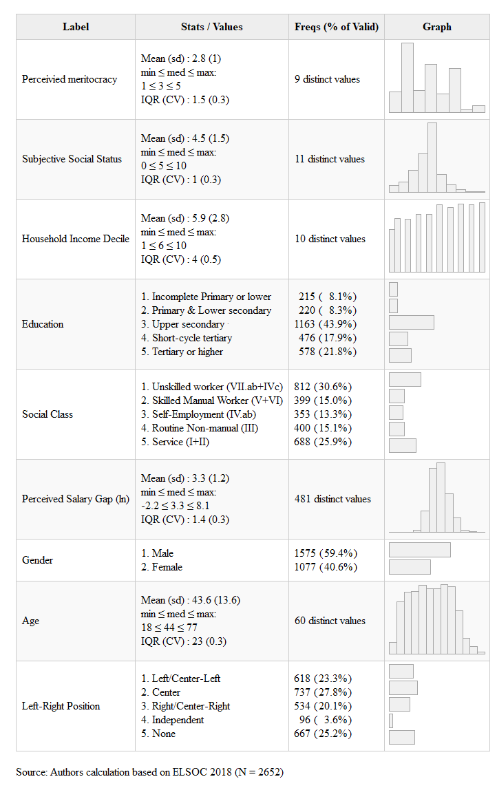

```{r render,include=FALSE, eval=FALSE}
 rmarkdown::render("paper-eng.Rmd")
```

```{r setup, include=FALSE}
 knitr::opts_chunk$set(
 	echo = FALSE,
 	message = FALSE,
 	warning = FALSE,
 	cache = TRUE,
 	fig.align = 'center'
 )
 options(scipen=999)
 rm(list=ls())
 options(knitr.kable.NA = '')
```

# Introduction

Through the satiric novel, _The rise of meritocracy_, Michael @Young1961 introduced the term _meritocracy_, described as a system in which merit, understood as the combination of effort and talent, is the primary distributive mechanism [@Sen2000]. From a sociological standpoint, the meritocratic ideal denotes a social regime in which social inequality is tolerated, and the belief that some deserve to be at a disadvantage is morally justified [@Castillo2011; @Svallfors2006].

In recent years the discussion about the rise of economic inequality [@piketty_capital_2014] and stagnation of the social mobility rate [@oecd_broken_2018] increased the attention of social scientists on how societies perceive meritocracy due to its relevance in the moral justification of economic inequality [@Roex2018; @mijs_meritocracy_2020]. It has been shown that the perception of how economic resources are distributed in society tends to be stratified by social status [@Aalberg2003; @Janmaat2013]. Thus, in societies with a strong attachment to meritocratic ideals, status attainment is mainly attributed to the individual agency rather than structural constraints [@bucca_merit_2016].

@Kluegel-Smith1986 argues that studying social inequality from a subjective standpoint takes into account elements of individual experience but also allows us to unveil the character of a society's normative structure. In this regard, evidence suggests that preferences and perceptions are explained, on the one hand, by the hierarchical position in the social structure [@Meltzer81; @Benabou2006], as well by the perceived social standing [@Castillo2013; @Mclure-etal2019; @Andersson2018].

The literature has strongly suggested that socioeconomic status is crucial in explaining general perceptions of inequality [@Manstead2018; @Evans2017] and meritocracy in particular [@Kunovich2007; @Xian2017; @Duru-bellat2012; @Smith2012]. However, the evidence is inconclusive due to discrepancies in the measurement strategy of meritocracy-related constructs, omitting substantive distinctions between perceptions and preferences [@castillo_measuring_2021]. Furthermore, research in this field has paid more attention to socioeconomic factors for explaining perceived meritocracy, to the detriment of the role of subjective social status and reference groups as an explanatory phenomenon of perceived meritocracy [@Evans2004; @Evans2017].

This article scrutinizes the relationship between objective and subjective social status with perceived meritocracy. In this line, some studies argue that subjective social status can be a proxy for objective status [@Lindemann2014; @Andersson2018; @ChenWilliams2018]. Nevertheless, it has been shown that the bias on subjective status is influenced by the attributes of reference groups [@Evans1992; @Evans2004]. Concerning this evidence, this study aims to understand how meritocracy perception is influenced by socioeconomic factors and subjective social status, in addition to examining the moderating role of the latter.


## Meritocracy perception

First, _merit_  is understood as the combination of an individual's effort and ability [@Sen2000]. Second, the meritocratic ideal assumes that status achievement is not constrained by how opportunities are structured in society [@mccall_exposure_2017]. Both constitute the substantive core of how meritocracy can be understood. Nevertheless,  studies have paid little attention to the construct measurement of concepts related to meritocracy, and low empirical precision is often noticed due to the indistinctly use of descriptive and normative dimensions [@Castilloetal2019]. 

For instance, studies on meritocracy have made undifferentiated use of concepts such as *Meritocratic Beliefs* [@Kunovich2007; @McCoy2007; @Ellis2017; @mijs_how_2021a; @bernardo_meritocracy_2021], *Meritocratic Ideals*, [@Reynolds2014] or *Perceived Meritocracy* [@Xian2017], which constitutes a difficulty to empirically assess the role of social status on the perception of meritocracy. This lack of distinction in the literature suggests considering a more accurate definition of the construct. Furthermore, this would lead to more precise about the phenomenon being examined and produce better evidence regarding the empirical study of the subjective aspects of meritocracy [@Castilloetal2019]. 

On the one hand, @Aalberg2003 defines _perception_ as the subjective estimation of an external object depicted by individuals. Therefore, the descriptive dimension does not consider the normative evaluation of the object. On the other hand, @Druckman2016a defines the normative dimension as the expression of preferences, understood as evaluating an external object based on the available information. In addition, @Feldman2001 suggests that preferences are also influenced by the structure and internalisation of ideological values, which operate as an essential explanatory mechanism [@Kulin2013]. In this context, the descriptive dimension is addressed when we talk about meritocracy perception. In other words, this means "how meritocracy is" rather than "how it should be". For instance, @Garcia2001 argues that meritocracy perception corresponds to the degree to which individuals consider that their society complies with the principles of a meritocracy, i.e., it functions as a system that allocates rewards based on effort and talent. 

## Status and meritocracy perception

The evidence on the relationship between social status and meritocracy follows the general assumption that individuals with higher social status have a higher meritocracy perception. From a self-interest approach [@Meltzer81] it is possible to argue that individuals who belong to the higher strata of the income distribution have a favourable perception of meritocracy to the extent that they have accumulated economic resources as a result of their effort and talent. In this line, empirical evidence suggests that higher status positions are related to lower inequality perception [@Evans2017; @Landerretche2011; @Kuhn2013] and the highest justification of economic inequality [@Castillo2011; @Trump2017; @Jasso2015]. Regarding meritocracy, the core idea is that merit explains status achievement. In this sense, if higher perceived equity is related to structural opportunities to get ahead, it is reasonable to argue that meritocracy constitutes the central mechanism for justifying differences in social status [@McCoy2007; @Davey1999].

Evidence suggests a positive relationship between income and perceptions of meritocracy regarding the importance of individual merit in getting ahead in life [@Reynolds2014; @Xian2017; @Sandoval2017], as well with the agreement levels regarding how intelligence and skills are rewarded [@Castilloetal2019; @Duru-bellat2012]. Additionally, it has been shown that lower-income strata decrease the probability of agreeing with the importance of meritocracy, while for the upper strata, the probability is significantly higher [@Newman2015; @Solt2016]. The rational self-interest hypothesis assumes that individuals with more economic resources attribute more importance to merit and therefore perceive that they are appropriately rewarded. That said, it is possible to argue that:

> $H_{\text{1a}}$: A higher position in the income distribution is positively associated with perceived meritocracy.

In the same way that income reflects an individual's economic resources, the study of meritocracy concerning educational attainment has been mainly addressed by studies on social stratification [@Goldthorpe2003]. Studies on meritocracy perception have discussed two theoretical approaches. On the one hand, the *reproductionist* approach [@Bourdieu2009; @Bernstein2003] supports the *socialisation* hypothesis. The main argument is that school socialisation operates as a normative reinforcement of meritocratic ideals, then educated individuals tend to attribute more importance to merit and justify economic inequality [@Lampert2013; @Duru-bellat2012]. On the other hand, the *instruction* hypothesis suggests that adherence to meritocratic ideals tends to weaken in individuals with higher educational attainment because they would be more aware of the relationship between individual and structural factors that explain status acquisition [@Duru-bellat2012; @Schneider2015].

Empirical evidence provides support for both approaches. However, it should be noted that these results can be attributed to differences in the measurement of perceived meritocracy. On the one hand, studies report evidence in favour of the socialisation hypothesis have pointed out that greater educational attainment is associated with greater attributed importance of individual factors in getting ahead in life [@Xian2017; @Reynolds2014; @mijs_paradox_2021; @Newman2015; @Solt2016], as well as determining the attainment of a better salary [@Kunovich2007]. On the other hand, evidence in favour of the instruction hypothesis shows that individuals with higher educational attainment strongly disagree that people are rewarded for their effort and talent [@Duru-bellat2012; @Castilloetal2019; @bubak_perceptions_2019]. Additionally, the argument of the instructional hypothesis can be complemented by the fact that individuals with greater awareness of inequality may experience feelings of injustice and relative deprivation since individuals with the same educational attainment have access to unequal rewards [@Adams1965; @Smith-eta2020_relative-deprivation]. In this sense, it has been shown that individuals with higher educational attainment are those who perceive greater wage inequality [@Castillo2012a_justice]. If perceived meritocracy is understood as " the perception society is based on the principles of meritocracy" [@Garcia2001], it corresponds to the descriptive appraisals of the link between merit and rewards. Then, we can argue that: 

> $H_{\text{1b}}$: Higher educational attainment is negatively associated with perceived meritocracy.

The relationship between social status and meritocracy has focused on income and educational attainment, setting social class aside from the discussion. However, it has been shown that occupation represents a characteristic that synthesises educational attainment and income level [@Ganzeboom1991; @Ganzeboom1992], therefore is considered one of the main status symbols in contemporary societies [@Chan2004; @Chan2007]. Furthermore, studies on social mobility have shown the relevance of studying social inequality through class schemes because they classify individuals according to their occupation, autonomy and authority in the workspace [@Erikson1992; @Erikson2002].

Evidence on social stratification suggests that occupation-based class schemes assume that individuals are similar in terms of their structural position in the labour market and levels of authority and control over work [@Connelly2016]. In this regard, @Chan2004 argue that common characteristics do not preclude the possibility of heterogeneity within classes, for instance, in terms of substantive differences in cultural consumption and political preferences [@Chan2007].

Regarding distributive preferences, @Svallfors2006 has suggested that social class, unlike other approaches, reflects individuals' views of the labour market, mainly how economic resources are distributed. Similarly, @Kulin2013 argue that lower classes have greater exposure to labour market risks, such as the likelihood of job loss and lower wages, meaning that individuals who experience the highest material deprivation and risk exposure would be those with favourable preferences towards redistribution [@rehm09]. That said, the main prediction of this literature is that individuals belonging to social classes with higher material well-being would mostly disagree with decreasing economic inequality through redistributive measures.

The study of subjective meritocracy has shown little evidence of the role of social class. For example, @Smith2012 found that individuals belonging to the emerging petty bourgeoisie show higher levels of agreement with meritocracy than wage earners. These results align with the findings of @Sandoval2017, where skilled and service workers, compared to unskilled workers, attribute greater importance to merit to get ahead in life. On the other hand, @Canales2015lse studied the relationship between social mobility and perception of meritocracy in Chile, showing that those who experienced upward social mobility towards the service class are less likely to consider that merit is rewarded in Chile.

In Chile, social mobility studies have analysed changes in the social structure that have shown fluidity in upward social mobility [@Torche2005a]. However, it has been shown that these transformations in the occupational structure have not been accompanied by significant changes in disposable income, because the relative income distribution has remained stable over time [@EspinozaNunez2014]. Additionally,  during the last decade, the size of the "middle classes" has persistently increased, mainly due to the relative increment of professional and technical occupations during the changes in the Chilean social structure known as _mesocratisation_ [@Mclure_etal2014]. In this sense, it has been shown that these changes were generated by the expansion of tertiary education, accompanied by labour market transformations that resulted in an average wage increase without significantly modifying market income inequality. Using a cohort analysis, @MacClure2012 analysed changes in income of the self-employed class using data from the Socioeconomic Characterisation Survey (CASEN) from 1998 to 2009, 
focusing on the cohort that joined the labour market from 1990 onwards. The results show the positive impact on wages of having completed higher education, particularly when considering the disparities concerning the quality and prestige of tertiary education institutions, even considering the importance of class origin in the stratified access to higher education [@MacClure2012].

It can be argued that in contexts of high economic inequality, relative position in occupational terms and upward social mobility bring with them that individuals in such positions are dissatisfied with the idea that efforts are rewarded in their society. In Chile, a sense of frustration has been narrated by individuals with a lower-class background who have experienced upward social mobility [@barozet_clase_2014], pointing out that class background is a constant source of discrimination in the labour market [@cea_discriminacion_2020]. Chile is a country where the middle classes have grown significantly via upward social mobility. It has been shown that meritocratic perception becomes critical regarding meritocracy, mainly among individuals with higher educational attainment and those who work in white-collar occupations. As a result, we can argue that:

> $H_{\text{1c}}$: Working in non-manual and services occupations is negatively associated with perceived meritocracy.

## Subjective social status and meritocracy perception

On the one hand, the literature on subjective meritocracy has paid more attention to the structural position of individuals as an explanatory factor for perceptions of meritocracy [@Reynolds2014; @Duru-bellat2012; @Kunovich2007]. On the other hand, interactions between individuals and groups establish a standpoint that frames experiences regarding social inequality, allowing individuals to generate explanations based on the character of these experiences [@garcia-castro_perceiving_2020; @madeira_primes_2019].

Social interactions serve as anchors through which individuals rationalise their social status. It is influenced by normative appraisals of qualitative or ascribed status characteristics such as gender or quantitative such as income or educational level [@Jasso2001]. The empirical study of this phenomenon has been conceptualised as subjective social status, understood as the perception of an individual or group's social standing in the social hierarchy in comparison to a reference group, such as society itself [@slomczynski1987; @Evans2004] or to their local communities or social classes [@Condon2020]. Measuring subjective social status is commonly done using the MacArthur Scale of Subjective Social Status, in which individuals report social status on a 10-rung ladder that aims to represent the different strata of the social hierarchy [@adler_relationship_2000].

One of the main findings in this literature is that individuals' perception of their position in the social hierarchy shows a persistent bias toward the middle of the hierarchy, demonstrating that high-status individuals tend to underestimate their position, while low-status individuals tend to overestimate it [@Lindemann2014; @chen_discordance_2015; @Andersson2018a; @Sudo2019]. In addition, previous theoretical approaches have suggested that individuals are likely to compare themselves with people or groups perceived as similar. These reference groups contribute to diminishing cognitive dissonance and seek to assemble better estimations about their position in society [@festinger1954theory; @Merton1968].

The literature has suggested that perceptual biases can be explained through an availability heuristic, which reduces cognitive dissonance in situations with limited information [@Evans2004; @Castillo2013]. In this line, the characteristics of the closest reference groups shape subjective estimates of social standing, in which the images created about society are influenced by the homophily of their close networks [@Evans1992; @Evans2017]. For instance, the @son_cognitive_2021 study reveals that being a member of an organisation or practising a hobby contributes as symbolic pieces of information that shape the observer's cognitive patterns of homophily. In other words, people consider that individuals that share these attributes tend to be tied (e.g. friendship) and considered members of a similar group. In this regard, @kim_social_2021 have shown that individuals with close networks that concentrate people with high-status occupations tend to report higher subjective social status in Chinese society, where social capital is considered essential. On the other hand, in an individualised society like Japan, the socioeconomic diversity of the close network does not influence subjective social status. 

There is substantial evidence that socioeconomic status is a robust predictor of subjective social status, but it has been demonstrated that income, compared to education and class, has a stronger association with the perception of individuals about their standing in society [@Castillo2013; @Andersson2018a; @IturraMellado2019]. Nevertheless, the literature has shown little evidence about the influence of subjective status on perceptions or preferences towards inequality. For example, @Vargas-Salfate2018 found that higher subjective status is related to a positive perception of the distributive system. Similarly, @Schneider2015 found that higher subjective status is related to the highest justification of inequality and higher internal and lower external poverty attributions. In addition, @Castillo2018 found that higher subjective status is related to lower perceptions of inequality, and in turn, to higher perceptions of meritocracy. Based on this evidence, our main prediction is:

> $H_{\text{2}}$: A higher individual subjective social status is positively associated with perceived meritocracy

## Status interplay and perceived meritocracy

Subjective social status has been little studied as a phenomenon that could moderate the influence of the direct experiences provided by the material factors [@Evans2017] over perceptions related to economic inequality.

Studies on subjective social status have shown that among higher income groups, the inconsistencies regarding perceived status tend to be higher [@Castillo2013]. For instance, @Andersson2018a has shown that disposable income, years of education and occupational prestige have a positive but non-linear relationship with subjective social status, indicating that individuals on the top rungs of the social hierarchy are those who also manifest the highest levels of variation in subjective status. On the one hand, attention to the role of status inconsistencies on individual preferences has focused on inconsistencies between income level and educational attainment [@Kreckel1993], demonstrating that a lower correlation between them can explain political preferences [@Lenski1967; @Varas2015]. On the other hand, studies like @Sosnaud2013 have analysed the inconsistencies between class identity and social class as an explanatory phenomenon of political preferences using data from the United States, establishing that those who tend to overestimate their class position prefer to vote for the conservatives; however, these results are not robust to the incorporation of socio-demographic controls.

The literature that considered the role of subjective social status as a moderating variable has mainly focused on how it relates to other subjective variables, paying less attention to how the perception of social status interacts with objective factors like income or education. A study conducted by @Fatke2018 using data from the International Social Survey Programme (ISSP) analysed the role of diagrammatic perceptions of inequality in redistributive preferences and perceptions of meritocracy, focusing on the role of subjective status as a moderator of inequality perception. First, the results show that higher perceptions of inequality lead to higher preferences for redistribution and lower perceptions of meritocracy. Secondly, the relationship between inequality and meritocracy perception becomes weaker for those who perceive themselves as having a higher societal position. On the other hand, a study on European countries [@Bobzien2019] showed that economic inequality does not influence preferences for redistribution when controlled by perceived inequality because it negatively influences preferences for redistribution and is positively moderated by subjective status. In other words, when the subjective status is higher, the negative relationship of inequality perception with redistributive preferences tends to weaken. Another study by @bernardo_meritocracy_2021 analysed the relationship between intolerance of inequality and perceived meritocracy in a sample of Filipino university students of high subjective social status, indicating that those who perceive themselves to have a higher subjective social status and perceive greater meritocracy tend to justify higher levels of economic inequality.

Experimental studies that have analysed the role of status incongruence have pointed out that it is possible to manipulate individuals' perceptions about their standing in the social structure. Second, manipulation via informational correction of this bias contributes to a change in attitudes towards inequality. For instance, @Cruces2011 demonstrates that Argentinians from the lowest and highest income decile display the highest levels of bias because those in the lowest stratum tend to overestimate their position in income distribution. In contrast, the wealthiest decile tends to underestimate their standing. Additionally, the experimental manipulation generates that those who have overestimated their relative position and perceived that they were relatively more affluent than they were, tend to demand more redistribution. Similar results are reported by @karadja_richer_2017 in Sweden, observing that older people, educated and cognitively more skilled, tend to be more accurate about their position in the income distribution. In this regard, it is hypothesised that those with stronger meritocratic beliefs (e.g. effort is the cause of wealth) would not be affected by the informational intervention and, therefore, would have fewer preferences toward redistribution. Finally, @hvidberg_social_2020 have argued that the attributes of the reference groups to which the comparison is engaged, have an effect on the perception of distributive justice, distinguishing between "large groups", such as people of the same gender or with workers in the same economic sector, and "small groups" (e.g. colleagues or neighbours). In this respect, misperception tends to be higher in large reference groups than in small reference groups. In other words, those who overestimate their position around the median of any reference groups increase their perception of inequality and injustice when informed of their actual position, mainly those belonging to the lowest income stratum.

Studies in Chile have argued that three elements interact in the formation of the perception of social status: socioeconomic status, economic, symbolic and social _capitals_, and moral perceptions about individual achievement [@macclure_naming_2020]. In this line, @Mclure-etal2019 have shown that those who identify as lower status tend to have low incomes, less educational attainment, and live in disadvantaged urban areas. However, there are circumstances that individuals identify themselves as low status while belonging to an intermediate or high socioeconomic stratum. On the one hand, it is argued that living in a more traditional neighbourhood or having higher educational credentials can explain this bias regarding the symbolic value of these qualities that represent higher levels of social and cultural capital [@Mclure-etal2019, p. 18]. On the other hand, those who identify as high status tend to be consistent concerning their socioeconomic characteristics compared to those who identify with the lower stratum, where educational meritocracy represents a distinguishing criterion of their social position [@Mclure-etal2019, p. 19]. 

On the one hand, empirical evidence suggests that subjective social status reflects part of the experience of individuals given their position in the social structure. In other words, differences in the perception of social status within socioeconomic strata are expected to influence the perception of meritocracy in society. Therefore, it is possible to argue that:

> $H_{\text{3}}$: the relationship between objective position and perceived meritocracy is positively moderated by subjective social status.


<!-- Lo que @Araujo2011 conceptualizan como **Inconsistencia de Estatus**, sugiere que las condiciones objetivas de vida se encuentran en un constante riesgo de sufrir procesos de desestabilización, generando sentimientos de amenaza e insatisfacción, que se traduce en percepciones sesgadas sobre su posición real en la estructura social. Conforme a la evidencia previa, es pesquisar exploratoriamente que el efecto de las condiciones objetivas sobre la percepción de meritocracia es mediado por las apreciaciones sobre el estatus social, por esta razón sostengo que: -->


<!-- Es argumentable que a experiencia que deviene de la posición estructural, a su vez, se ve afectada por la percepción que poseen los individuos de su posición social. -->

<!-- * de qué manera las diferencias perceptivas al interior de un estrato objetivo pueden generar variaciones en la percepción de meritocracia al interior del estrato -->

<!-- * Es la heterogeneity en la percepción de estatus social subjetivo la que puede explicar -->

<!-- * Aquellos que se posicionan más alto en la jerarquía social, pero que perciven estar más abajo en dicha estructura, son quienes perciben menor meritorcacia. -->

<!-- * mayor creencia en los valores de la meritocracia se relaciona con menor intolerancia a la desigualdad (mayor justificación) -->

<!-- * Es decir, más estatus y más meritocracia, menos intolerancia (justifican más la desigualdad) -->

Figure \@ref(fig:tmodel) depicts the theoretical model proposed for the main hypothesis.

```{r tmodel, fig.cap='Theoretical model',out.height='40%', fig.align='center'}
 knitr::include_graphics(path = "input/images/scheme.PNG")
```


# Data, variables and methods

_Data_ 

The data used correspond to the third wave of the Longitudinal Social Study of Chile [@coes_estudio_2018], a survey developed to analyse the evolution of conflict and social cohesion in Chilean society over time. The sampling is probabilistic, stratified, clustered and multistage, with a total of 3748 participants aged between 18 and 75 years. An analytical sample of 2077 cases with complete information was obtained for the analyses. 

_Variables_ 

The study variables and their description can be seen in Table \@ref(tab:desc01). The main dependent variable is _perceived meritocracy_, operationalised through the average score of two indicators ($alpha = 0.83) that capture the degree of agreement on whether effort and intelligence are rewarded in Chile and that have been used in international comparative studies [@Duru-bellat2012]. Both indicators are five-category Likert scales, where higher values represent higher perceptions of meritocracy.

The objective position is measured through three variables. First, El _Household Income Decile_ is calculated using monthly per capita household income and categorised into deciles.  Second, _Educational level_ corresponds to the five categories for educational attainment following the International Standard Classification of Education [@unesco_international_2012]. Finally, we use an adapted five-category version of the EGP class scheme [@Connelly2016], a commonly used measurement in social stratification research [@solis_class_2019]. For the computation of the class scheme, the Stata package `isko` is used [@hendrickx_isko_2002].

The subjective social status is measured using an 11-point scale variable in which respondents identify themselves on the social ladder by answering _"In our society, some groups are usually at the higher levels, and others tend to be placed at the lower levels of society. Using the presented scale, where 0 is the lowest level, and 10 is the highest level, where would you put yourself in Chilean society?."_, where higher values represent a higher perceived social status.

Control variables are age, gender, political identification and the perceived salary gap.


```{r ,include=FALSE}
 # Funciones para renderizar tablas tanto en HTML como en pdf
 if (!require("pacman")) install.packages("pacman")  #si falta pacman, instalar
 if (!require("tinytex")) install.packages("tinytex")#si falta tinytex, instalar
 pacman::p_load(knitr, summarytools, kableExtra, dplyr, lavaan,
                haven, htmlwidgets, webshot, sjPlot,sjlabelled) # librerias
 knitr::opts_chunk$set(warning = FALSE,  # mensaje de warning
                       message = FALSE,  # mensajes/avisos de librerias
                       cache = FALSE,    # cache de los chunks,usar analisis pesados
                       out.width = '85%',# largo de imagen en %
                       fig.pos= "H",     # posicion figuras H = HERE
                       echo = FALSE      # incluir chunk en output
 )
 # Otras configuraciones
 options(scipen=999) # notacion cientifica
 options(knitr.kable.NA = '') # NA en kable = ''
 # Funciones para renderizar tablas tanto en HTML como en pdf
 fwidth = if(is_html_output()) { #Usar en argumento "full_width" de kableExtra
   T
 } else if(is_latex_output()) {
   F
 }
 graph.magnif_table = if(is_html_output()) { # Usar en argumento "graph.magnif=" de summarytools
   1.2
 } else if(is_latex_output()) {
   0.75
 }
 width_table = if(is_html_output()) {
   800
 } else if(is_latex_output()) { # Usar en "width=" dentro del argumento "image=" en kable
   500
 }
 # Css
 st_css()
 st_options(lang = "en",
            footnote = "Source: Authors calculation based on ELSOC 2018 (N = 2077)",
            bootstrap.css = F,
            # custom.css = "input/css/dfsummary.css"
            )
 # Cargar base de datos procesada
  load(here::here("input/data/proc/elsoc_w03.RData"))
  varlabs <- sjlabelled::get_label(elsoc_w03) #recuperar labels
  elsoc_w03$meffort <-
   factor(elsoc_w03$meffort,
          levels = 1:5,
          labels = c("Strongly disagree","Disagree",
                     "Neither agree nor disagree", "Agree", "Strongly agree"))

  elsoc_w03$mtalent <-
   factor(elsoc_w03$mtalent,
          levels = 1:5,
          labels = c("Strongly disagree","Disagree",
                     "Neither agree nor disagree","Agree","Strongly agree"))

  elsoc_w03$edcine2 <-
   factor(elsoc_w03$edcine2,
          levels = levels(elsoc_w03$edcine2),
          labels = c(
            "Incomplete Primary or lower",
            "Primary & Lower secondary",
            "Upper secondary ",
            "Short-cycle tertiary",
            "Tertiary or higher"
          ))

   elsoc_w03$egp05 <-
   factor(elsoc_w03$egp05,
          levels = levels(elsoc_w03$egp05),
          labels = c(
            "Unskilled worker (VIIa+VIIb)",
            "Skilled Worker (V+VI)",
            "Self-Employment (IVab+IVc)",
            "Routine Non-manual (III)",
            "Service (I+II)"))

   elsoc_w03 <- na.omit(elsoc_w03)
   set_label(elsoc_w03) <- varlabs
  elsoc_w03$merit <- 
   (as.numeric(elsoc_w03$meffort)+as.numeric(elsoc_w03$mtalent))/2
  elsoc_w03$merit <- sjlabelled::set_label(elsoc_w03$merit,"Perceivied meritocracy")   
  df_desc<- elsoc_w03 %>%
    dplyr::select(merit,meffort,mtalent,
           inc10h.imp,edcine2,egp05,ess,lngap_perc,
           sexo,edad,ppolcat) %>% 
    dplyr::select(-meffort,-mtalent,
                  # -sexo,-edad,
                  # -ppolcat,-lngap_perc
                  )
 df<- dfSummary(df_desc,
                plain.ascii = FALSE,
                style = "grid",
                tmp.img.dir = "/tmp",
                graph.magnif = TRUE,
                headings = F,  # encabezado
                varnumbers = F, # num variable
                labels.col = T, # etiquetas
                na.col = F,    # missing
                graph.col = T, # plot
                valid.col = T,max.string.width = 50,
                max.distinct.values = 8 # n valido 
                # col.widths = c(1000,10,10,10)
                )
 df$Variable <- NULL # delete variable column
 df$Valid <- NULL
 summarytools::view(df,file = "output/tables/desc01.html") # Ver tabla en un archivo HTML
 webshot(url ="output/tables/desc01.html",
         file ="output/tables/desc01.png",
         vwidth = 700,vheight = 600) # Remover archivo HTML
```

```{r desc01, echo=FALSE, results='asis',fig.align='center'}
 # REVISAR EL N
 knitr::kable(data.frame(image='{height=80%}'),    # generar tabla
              caption="Study variables",
             col.names = "",
             row.names = F,
             format = "pandoc") %>%
  kable_styling(latex_options = c("HOLD_position","scale_down"),
                full_width = fwidth)
```

_Method_

Considering the dependent variable as a continuous, stepwise ordinary least square regression models are used (OLS). First, models are estimated for each of the independent variables. Second, a series of models are estimated that consider the interaction term between objective position and subjective status. Interactions effects are presented using average marginal effects and linear predictions.

# Results

## Descriptive

```{r plot-likert, fig.height=3, fig.width=10, fig.cap='Perceived meritocracy items'}
 load(here::here("input/data/proc/elsoc_w03.RData"))   
 pacman::p_load(dplyr,sjPlot,ggplot2)
 elsoc_w03 <- na.omit(elsoc_w03)
 dat_likert_s1 <-
   dplyr::select(elsoc_w03,meffort,mtalent)
 dat_likert_s1 <- sjmisc::rec(dat_likert_s1, rec="rev", append=FALSE)

   ggplot2::theme_set(ggplot2::theme(panel.background = ggplot2::element_rect(fill = "gray85",
                                                                              colour = "gray85"),
                                     panel.border = ggplot2::element_blank(),
                                     axis.text.y = ggplot2::element_text(size = 13,
                                                                         hjust = 1),
                                     title = ggplot2::element_text(size = 13,
                                                                   face = "bold"),
                                     legend.text = ggplot2::element_text(size = 12),
                                     plot.caption = ggplot2::element_text(size = 10,
                                                                          face = "plain",
                                                                          hjust = 1)))

     sjPlot::plot_likert(dplyr::select(dat_likert_s1,meffort_r,mtalent_r),
                         geom.colors = "PuBu",
                         geom.size = 0.8,
                         axis.labels = c("People are rewarded for their efforts",
                                         "People are rewarded for their intelligence and ability"),
                         cat.neutral = 3,
                         grid.range  =  c (1.2 , 1.2),
                         values  =  "sum.outside",
                         reverse.scale = F,
                         show.n = FALSE) +
       theme(legend.position="bottom") +
       ggplot2::scale_fill_manual(
         values = c("#b3b3b3ff", "#f1eef6ff", "#bdc9e1ff","#74a9cfff","#0570b0ff"),
         breaks=c("neutral",4,3,2,1),
         labels=c("Neither agree \nnor disagree","Strongly \ndisagree", "Disagree",
                     "Agree", "Strongly \nagree")) +
       labs(caption = paste0("Source: Authors calculation based on ELSOC 2018",
                             " (n=",dim(elsoc_w03)[1],")"))
```

Figure \@ref(fig:plot-likert) depicts the distribution of responses of the two indicators for the perception of meritocracy, showing that most individuals tend to disagree or strongly disagree with the statement. For example, regarding the statement about how _effort_ is rewarded, 51.2% answered that they disagree or strongly disagree. In the same direction, the perception regarding rewards from  _intelligence and hability_, the level of disagreement decreases to 43.3%. Finally, about 20% of the respondents do not have a negative or positive perception of the link between rewards and merit in society.   

```{r corr-mat,  fig.cap='Correlation matrix between social status and perceived meritocracy', fig.height=8, fig.width=10, out.width='80%'}
 load(here::here("input/data/proc/elsoc_w03.RData"))
 pacman::p_load(dplyr,sjPlot,ggplot2,psych,polycor)
 elsoc <- na.omit(elsoc_w03)
 elsoc_w03$merit <- 
   (as.numeric(elsoc_w03$meffort)+as.numeric(elsoc_w03$mtalent))/2
 df_corr<- 
   elsoc %>% 
   dplyr::select(meffort,mtalent,inc10h.imp,edcine2,egp05,ess) %>% 
   na.omit()
 cormat<- polycor::hetcor(data = df_corr,parallel = T)
 cormat <- as.matrix(cormat)

  diag(cormat) = NA #set diagonal values to NA
  # Set Row names of the matrix
  rownames(cormat) <- c("A. People are rewarded for their efforts",
                       "B. People are rewarded for their intelligence",
                       "C. Household income decile", 
                       "D. Educational level",
                       "E. Social Class (EGP05)",
                       "F. Subjective social status")
  #set Column names of the matrix
  colnames(cormat) <-c("(A)", "(B)","(C)","(D)","(E)","(F)")
  #Plot the matrix using corrplot
  corrplot::corrplot(cormat,
    method = "color",
    addCoef.col = "#000390",
    type = "upper",
    tl.col = "black",
    col=colorRampPalette(c("white","#0068DC"))(12),
    bg = "white",
    na.label = "-")
  text(4.7, 0.6, paste0("Source: Authors calculation based on ELSOC 2018",
                             " (n=",dim(df_corr)[1],")"),   
       cex = 0.75)
  
```

Figure \@ref(fig:corr-mat) shows the correlations between perceived meritocracy and social status indicators. First, it is observed that the indicators of perceived meritocracy show a strong and positive association (_r_ = 0.77) and can be interpreted as evidence in favour of the idea of a common concept. Second, according to the hypothesis, the association between perceived meritocracy and income decile is weak and positive. On the other hand, educational level and social class display a weak and negative association. Third, the association between perceived meritocracy and subjective social status is weak and positive but higher than objective status measures. In this respect, the association between subjective status is slightly stronger with the indicator for _effort_ (_r_ = 0.1) in contrast to the indicator for _intelligence_ (_r_ = 0.07).
     

```{r eval=FALSE, include=FALSE}
 load(here::here("input/data/proc/elsoc_w03.RData"))
 elsoc_w03 <- na.omit(elsoc_w03)
 pacman::p_load(ordinal,texreg, dplyr, ggplot2, knitr, kableExtra)
 elsoc_w03$ess10top <- car::recode(elsoc_w03$ess+1,recodes = "10:11=10")
 # sjPlot::plot_frq(elsoc_w03$ess)
 sjPlot::plot_frq(elsoc_w03$ess10top)
 # sjPlot::plot_frq(elsoc_w03$ess10bot)
 # sjPlot::plot_frq(elsoc_w03$inc10h.imp)
 elsoc_w03$ess_d10 <- elsoc_w03$ess10top-elsoc_w03$inc10h.imp
 # sjmisc::frq(elsoc_w03$ess_d10)
 elsoc_w03$inconsi <- car::recode(elsoc_w03$ess_d10,
                           recodes = "lo:-1='1';0='2';1:10='3'",
                           as.factor = T) %>%
    factor(.,levels = 1:3,
           labels = c("Underestimate","Consistent","Overestimate"))

 elsoc_w03 <-
    fastDummies::dummy_columns(.data = elsoc_w03,select_columns = "inconsi")

 # elsoc_w03 %>%
 #    group_by(inc10h.imp) %>%
 #    summarise(Underestimate=mean(inconsi_Underestimate)*100,
 #              Consistent=mean(inconsi_Consistent)*100,
 #              Overestimate=mean(inconsi_Overestimate)*100)

 # table(elsoc_w03$inconsi)
 # table(as.numeric(elsoc_w03$inconsi))
 elsoc_w03$inconsi <-as.numeric(elsoc_w03$inconsi)
 elsoc_w03$inconsi <- sjlabelled::set_labels(x = elsoc_w03$inconsi,
                                             labels = c("Underestimate",
                                                        "Consistent",
                                                        "Overestimate") )
 sjPlot::plot_likert(elsoc_w03 %>% select(inconsi),
                     cat.neutral = 2)
 
  sjPlot::plot_grpfrq(var.cnt = elsoc_w03$inc10h.imp,
                     var.grp =elsoc_w03$inconsi,
                     bar.pos = "stack",
                     show.n = F,
                     coord.flip = T)
```

## Multivariate analysis

Table \@ref(tab:merit) shows the regression analysis results for the models for each status variable, pursued by the models for the interactions of subjective social status with income, education, and social class.

Regarding household income, the results of Model 5 show that the relative position of individuals in the income distribution has a statistically significant association. In other words, these results do not support the rational self-interest hypothesis because the results suggest that higher economic resources do not influence the perception of meritocracy. 

Concerning educational level, Model 5 shows a negative and statistically significant relationship. Thus, as the educational level increases, the perception of meritocracy tends to decrease, contributing with evidence in favour of the instruction hypothesis, where people with higher educational attainment tend to have a more critical view of meritocracy. However, it should be noted that those with short-cycle tertiary education show slightly lower perceived meritocracy than those with tertiary or higher education.

For Social Class, Model 5 displays no statistically significant association between occupational class and perceived meritocracy, indicating the lack of evidence favouring the hypothesis that posits differences in perceived meritocracy between manual and intellectual workers.

The results show that subjective social status has a robust positive and statistically significant influence on perceived meritocracy in all specifications, according to the hypothesized association. In other words, when individuals compare themselves with the entire society and estimate their position on the social ladder, those with a higher subjective social status tend to increase their perception of meritocracy.    

```{r ols-merit, echo=FALSE, results='asis'}
 load(here::here("input/data/proc/elsoc_w03.RData"))
# elsoc_w03 <- elsoc_w03 %>% dplyr::filter(!(egptorche == "Autoempleo agrícola (IVc)"),!(egptorche == "Labores agrícolas (VIIb)") ) 

elsoc_w03 <- na.omit(elsoc_w03)
 elsoc_w03$merit <- (as.numeric(elsoc_w03$meffort)+as.numeric(elsoc_w03$mtalent))/2
 pacman::p_load(ordinal,texreg)
 elsoc_w03$mtalent <- as.numeric(elsoc_w03$mtalent)
 or01tal  <- lm(merit ~inc10h.imp+edad+sexo+ppolcat+lngap_perc,data= elsoc_w03)
 or02tal  <- lm(merit ~edcine2+edad+sexo+ppolcat+lngap_perc,data= elsoc_w03)
 or03tal  <- lm(merit ~egp05+edad+sexo+ppolcat+lngap_perc,data= elsoc_w03)
 or04tal  <- lm(merit ~inc10h.imp+edcine2+egp05+edad+sexo+ppolcat+lngap_perc,data= elsoc_w03)
 or05tal  <- lm(merit ~ess+edad+sexo+ppolcat+lngap_perc,data= elsoc_w03)
 or08tal  <- lm(merit ~inc10h.imp+edcine2+egp05+ess+edad+sexo+ppolcat+lngap_perc,data= elsoc_w03)
 or09tal  <- lm(merit ~inc10h.imp+edcine2+egp05+ess+inc10h.imp*ess+edad+sexo+ppolcat+lngap_perc, data= elsoc_w03)
 or10tal  <- lm(merit ~inc10h.imp+edcine2+egp05+ess+edcine2*ess+edad+sexo+ppolcat+lngap_perc,data= elsoc_w03)
 or11tal  <- lm(merit ~inc10h.imp+edcine2+egp05+ess+egp05*ess+edad+sexo+ppolcat+lngap_perc,  data= elsoc_w03)
 or12tal  <- lm(merit ~inc10h.imp*ess+edcine2*ess+egp05*ess+ess+edad+sexo+ppolcat+lngap_perc,  data= elsoc_w03)


 coef.names02 <-c("Household Income Decile",
                  "Primary and Lower secondary",
                  "Upper secondary",
                  "Short-cycle tertiary",
                  "Tertiary or higher",
                  "Skilled Worker (V+VI)",
                  "Self-Employed (IVab+IVc)",
                  "Routine Non-manual (III)",
                  "Service (I+II)",
                  "Subjective Social Status (SSS) ",
                  "Int. (Income Decile x Subj. Status.)",
                  "Primary and Lower secondary x SSS",
                  "Upper secondary x SSS",
                  "Short-cycle tertiary x SSS",
                  "Tertiary or higher x SSS",
                  "Skilled Worker (V+VI) x SSS",
                  "Self-Employed (IVab+IVc) x SSS",
                  "Routine Non-manual (III) x SSS",
                  "Service (I+II) x SSS")

 tab.caption02 <- "Linear Regression for Perception of Meritocracy"
 omit.coef02 <- c("((Intercept))|(edad)|(sexo)|(ppolcat)|(ppolcat)|(lngap_perc)|(estlab)")

 knitreg(l = list(or01tal,or02tal,or03tal,or05tal,or08tal,or09tal,or10tal,or11tal),
        include.thresholds = FALSE,
        custom.coef.names = coef.names02,
        caption.above = TRUE,
        caption = paste("(\\#tab:merit)",tab.caption02),
        float.pos = "h!",
        custom.model.names = paste0("Model ",c(1:8)),
        omit.coef = omit.coef02,
        scalebox = 0.7,
        groups = list("Education (ref: Incomplete Primary or lower)" = 2:5,
                      "Social Class (ref: Unskilled worker)" =6:9,
                      "Int. (Education x Subj. Status.)" =12:15,
                      "Int. (Class x Subj. Status.)" =16:19),
        custom.gof.rows = list("Controls"=rep("Yes",8))
        )
```

In Table \@ref(tab:merit), the interaction between subjective social status and objective status measures can be seen in Models 6 to 8. Overall, the three models show that subjective social status positively moderates the association of household income, education and social class, which constitute evidence in favour of the hypothesis. 

In this line, Figure \@ref(fig:marginal-merit) depicts the average marginal effects and the linear predictions for each model. Panel A shows the results

```{r marginal-merit, fig.cap='Marginal effects and predictions for the interaction effect between objective an subjective status on perceived meritocracy', fig.height=13, fig.width=22}
 load(here::here("input/data/proc/elsoc_w03.RData"))
 pacman::p_load(ordinal,texreg, interplot,sjPlot,dplyr,cowplot)  
 elsoc_w03 <- elsoc_w03 %>% 
   dplyr::select(meffort,mtalent,inc10h.imp,edcine2,egp05,ess,edad,sexo,
          ppolcat,lngap_perc) %>% 
   na.omit()
 elsoc_w03$merit <- (as.numeric(elsoc_w03$meffort)+as.numeric(elsoc_w03$mtalent))/2
 or09tal  <- lm(merit ~inc10h.imp+edcine2+egp05+ess+inc10h.imp*ess+edad+sexo+ppolcat+lngap_perc, data= elsoc_w03)
 or10tal  <- lm(merit ~inc10h.imp+edcine2+egp05+ess+edcine2*ess+edad+sexo+ppolcat+lngap_perc,data= elsoc_w03)
 or11tal  <- lm(merit ~inc10h.imp+edcine2+egp05+ess+egp05*ess+edad+sexo+ppolcat+lngap_perc,  data= elsoc_w03)

 # Income......................................................................
 marg09tal<- interplot(m = or09tal, var1 = "inc10h.imp", var2 = "ess",point = T) +
   geom_hline(yintercept = 0, linetype = "dashed") +
   scale_x_continuous(name = NULL,
                      breaks = 0:10,labels = c("Bottom", 1:9,"Top")) +
   ylab("A")+
   theme(axis.text=element_text(size=18),
         axis.title.y=element_text(size = 20,face = "bold", angle=0,vjust = 1)) 

 pred09tal<-
   plot_model(model = or09tal,
              type = "int",
              legend.title = "Subj. Status") +
   labs(title =NULL) + ylab(label = NULL) +
   scale_x_continuous(name = "Income Decile",
                      breaks = 1:10,labels = paste0("D",1:10)) +
   scale_color_discrete(guide = guide_legend(title.position = "top",
                                             direction = "horizontal",
                                             title.hjust = 0.5)) +
    
   theme(legend.position=c(0.1, 0.15),
         axis.text=element_text(size=15),
         legend.background = element_blank(),
         legend.box.background = element_rect(colour = "black"))
 # Education...................................................................
 lbeduc <- c("Incomplete Primary \n  or  less","Primary & \n Lower secondary",
             "Upper \n secondary ","Short-cycle \n tertiary","Tertiary \n or higher")

 marg10tal<- 
   interplot(m = or10tal, var1 = "edcine2", var2 = "ess", point = T,
             facet_labs = c("Primary & \n Lower secondary",
                            "Upper \n secondary ",
                            "Short-cycle \n tertiary","Tertiary \n or higher")) +
   geom_hline(yintercept = 0, linetype = "dashed") +
   ylab("B")+    
   scale_x_continuous(name = NULL,
                      breaks = 0:10,labels = c("B", 1:9,"T")) +
   theme(strip.text.x = element_text(size = 17),
         axis.text=element_text(size=17),
         axis.title.y=element_text(size = 20,face = "bold", angle=0,vjust = 1))

 pred10tal<- plot_model(model = or10tal,
                        type = "int",
                        legend.title = "Subj. Status") +
  labs(title =NULL) +  geom_line() + ylab(label = NULL)+
  scale_x_discrete(name=NULL,limits=1:5, labels = lbeduc) +
  scale_color_discrete(guide = guide_legend(title.position = "top",
                                            direction = "horizontal",
                                            title.hjust = 0.5)) +
  theme(
    legend.position=c(0.1, 0.15),
    axis.text=element_text(size=15),
    legend.background = element_blank(),
    legend.box.background = element_rect(colour = "black"))
 #Social Class..................................................................
 labsegp <- c("Unskilled worker \n(VIIa+VIIb)",
              "Skilled Worker \n (V+VI)",
              "Self-Employment\n (IVab+IVc)",
              "Routine \n  Non-manual (III)",
              "Service \n (I+II)")
 marg11tal<- interplot(m = or11tal, var1 = "egp05", var2 = "ess", point = T,
                      facet_labs = c("Skilled Worker \n (V+VI) ",
                                     "Self-employed \n (VIIa+VIIb)",
                                     "Routine Non-manual\n (III) ",
                                     "Service \n (I+II)")) +
   geom_hline(yintercept = 0, linetype = "dashed") +
   ylab("C")+        
   scale_x_continuous(name = NULL,
                      breaks = 0:10,labels = c("B", 1:9,"T")) +
   theme(strip.text.x = element_text(size = 17),
         axis.text=element_text(size=17),
         axis.title.y=element_text(size = 20,face = "bold", angle=0,vjust = 1))

 pred11tal <-
   plot_model(model = or11tal,
              type = "int",
              legend.title = "Subj. Status") +
   labs(title =NULL) +
   geom_line() +
   ylab(label = NULL) +
   scale_x_discrete(name=NULL,limits=1:5, labels = labsegp) +
   scale_color_discrete(guide = guide_legend(title.position = "top",
                                             direction = "horizontal",
                                             title.hjust = 0.5)) +
   theme(
     legend.position=c(0.1, 0.15),
     axis.text=element_text(size=15),
     legend.background = element_blank(),
     legend.box.background = element_rect(colour = "black"))

 # gridExtra::grid.arrange(marg09tal, pred09tal,
 #                         marg10tal, pred10tal,
 #                         marg11tal, pred11tal,
 #                         nrow = 3)
 cowplot::plot_grid(marg09tal, pred09tal,
                    marg10tal, pred10tal,
                    marg11tal, pred11tal,
                    # labels=c("A", " ","B", " ", "C", " "),
                    nrow = 3,label_size = 25)
 
```

# Dicussion and conclusion

* Comparación social y redes sociales sobre Meritocracia [juan_diego_2021]
* Beck

\pagebreak

# References

::: {#refs}
:::

<!-- Although <div> is an HTML tag, this method also works for other output formats such as PDF. -->

# (APPENDIX) Appendix {.unnumbered}


```{r ols-effort, eval=FALSE, include=FALSE, results='asis'}
 load(here::here("input/data/proc/elsoc_w03.RData"))
 elsoc_w03 <- na.omit(elsoc_w03)
 pacman::p_load(ordinal,texreg,car)
 elsoc_w03$ess <- car::recode(elsoc_w03$ess+1,recodes = "10:11=10")
 elsoc_w03$meffort <- as.numeric(elsoc_w03$meffort)
 or01   <- lm(meffort ~inc10h.imp,data= elsoc_w03)
 or02   <- lm(meffort ~edcine2,data= elsoc_w03)
 or03   <- lm(meffort ~egp05,data= elsoc_w03)
 or04   <- lm(meffort ~inc10h.imp+edcine2+egp05,data= elsoc_w03)
 or05   <- lm(meffort ~ess,data= elsoc_w03)
 or08   <- lm(meffort ~inc10h.imp+edcine2+egp05+ess+edad+sexo+ppolcat+lngap_perc,data= elsoc_w03)
 or09ef <- lm(meffort ~inc10h.imp+edcine2+egp05+ess+inc10h.imp*ess+edad+sexo+ppolcat+lngap_perc, data=elsoc_w03)
 or10ef <- lm(meffort ~inc10h.imp+edcine2+egp05+ess+edcine2*ess+edad+sexo+ppolcat+lngap_perc,data=elsoc_w03)
 or11ef <- lm(meffort ~inc10h.imp+edcine2+egp05+ess+egp05*ess+edad+sexo+ppolcat+lngap_perc,  data=elsoc_w03)
 coef.names01 <-c("Household Income Decile",
                  "Primary and Lower secondary",
                  "Upper secondary",
                  "Short-cycle tertiary",
                  "Tertiary or higher",
                  "Skilled Worker (V+VI)",
                  "Self-Employed (IVab+IVc)",
                  "Routine Non-manual (III)",
                  "Service (I+II)",
                  "Subjective Social Status (SSS) ",
                  "Int. (Income Decile x Subj. Status.)",
                  "Primary and Lower secondary x SSS",
                  "Upper secondary x SSS",
                  "Short-cycle tertiary x SSS",
                  "Tertiary or higher x SSS",
                  "Skilled Worker (V+VI) x SSS",
                  "Self-Employed (IVab+IVc) x SSS",
                  "Routine Non-manual (III) x SSS",
                  "Service (I+II) x SSS")
 tab.caption01 <- "Linear Regression Model for Perception of Meritocracy (Effort)"
 omit.coef01 <- c("((Intercept))|(edad)|(sexo)|(ppolcat)|(ppolcat)|(lngap_perc)|(estlab)")

 knitreg(l = list(or01,or02,or03,or05,or08,or09ef,or10ef,or11ef),
        # custom.coef.names = coef.names01,
        caption.above = TRUE,
        caption = tab.caption01,
        custom.model.names = paste0("Model ",c(1:8)),
        omit.coef = omit.coef01,
        scalebox = 1.0,    
        groups = list("Education (ref: Incomplete Primary or lower)" = 2:5,
                      "Social Class (ref: Unskilled worker)" =6:9,
                      "Int. (Education x Subj. Status.)" =12:15,
                      "Int. (Class x Subj. Status.)" =16:19)
        )
```

```{r marginal-effort, eval=FALSE, fig.cap='Marginal effects and predictions for the interaction effect between objective an subjective status on perceived meritocracy (Effort)', fig.height=11, fig.width=20, include=FALSE}
 load(here::here("input/data/proc/elsoc_w03.RData"))
 elsoc_w03 <- na.omit(elsoc_w03)
 pacman::p_load(interplot,sjPlot)
 elsoc_w03$meffort <- as.numeric(elsoc_w03$meffort)
 elsoc_w03$ess <- car::recode(elsoc_w03$ess+1,recodes = "10:11=10")
 or09ef <- lm(meffort ~inc10h.imp+edcine2+egp05+ess+inc10h.imp*ess+edad+sexo+ppolcat+lngap_perc, data=elsoc_w03)
 or10ef <- lm(meffort ~inc10h.imp+edcine2+egp05+ess+edcine2*ess+edad+sexo+ppolcat+lngap_perc,data=elsoc_w03)
 or11ef <- lm(meffort ~inc10h.imp+edcine2+egp05+ess+egp05*ess+edad+sexo+ppolcat+lngap_perc,  data=elsoc_w03)

 # Income......................................................................
 marg09ef<- interplot(m = or09ef, var1 = "inc10h.imp", var2 = "ess",point = T) +
   geom_hline(yintercept = 0, linetype = "dashed") +
   scale_x_continuous(name = NULL,
                      breaks = 1:10,labels = c("Bottom", 2:9,"Top")) +
   theme(axis.text=element_text(size=18))

 pred09ef<-
   plot_model(model = or09ef,
              type = "int",
              legend.title = "Subj. Status") +
   labs(title =NULL) + ylab(label = NULL) +
   scale_x_continuous(name = "Income Decile",
                      breaks = 1:10,labels = paste0("D",1:10)) +
   scale_color_discrete(guide = guide_legend(title.position = "top",
                                             direction = "horizontal",
                                             title.hjust = 0.5)) +
   theme(legend.position=c(0.1, 0.15),
         axis.text=element_text(size=15),
         legend.background = element_blank(),
         legend.box.background = element_rect(colour = "black"))
 # Education...................................................................
 lbeduc <- c("Incomplete Primary \n  or  less","Primary & \n Lower secondary",
             "Upper \n secondary ","Short-cycle \n tertiary","Tertiary \n or higher")

 marg10ef<- interplot(m = or10ef, var1 = "edcine2", var2 = "ess", point = T) +
   geom_hline(yintercept = 0, linetype = "dashed") +
   scale_x_continuous(name = NULL,
                      breaks = 1:10,labels = c("B", 2:9,"T")) +
   theme(strip.text.x = element_text(size = 15),
         axis.text=element_text(size=17))

 pred10ef<- plot_model(model = or10ef,
                       type = "int",
                       legend.title = "Subj. Status") +
  labs(title =NULL) +  geom_line() + ylab(label = NULL)+
  scale_x_discrete(name=NULL,limits=1:5, labels = lbeduc) +
  scale_color_discrete(guide = guide_legend(title.position = "top",
                                            direction = "horizontal",
                                            title.hjust = 0.5)) +
  theme(
    legend.position=c(0.1, 0.15),
    axis.text=element_text(size=15),
    legend.background = element_blank(),
    legend.box.background = element_rect(colour = "black"))
 #Social Class..................................................................
 labsegp <- c("Unskilled worker \n(VIIa+VIIb)",
              "Skilled Worker \n (V+VI)",
              "Self-Employment\n (IVab+IVc)",
              "Routine \n  Non-manual (III)",
              "Service \n (I+II)")
 marg11ef<- interplot(m = or11ef, var1 = "egp05", var2 = "ess", point = T,
                      facet_labs = c("Skilled Worker \n (V+VI)",
                                      "Self-Employment\n (IVab+IVc)",
                                      "Routine \n  Non-manual (III)",
                                      "Service \n (I+II)") ) +
   geom_hline(yintercept = 0, linetype = "dashed") +
   scale_x_continuous(name = NULL,
                      breaks = 1:10,labels = c("B", 2:9,"T")) +
   theme(strip.text.x = element_text(size = 15),
         axis.text=element_text(size=17))

 pred11ef <-
   plot_model(model = or11ef,
              type = "int",
              legend.title = "Subj. Status") +
   labs(title =NULL) +
   geom_line() +
   ylab(label = NULL) +
   scale_x_discrete(name=NULL,limits=1:5, labels = labsegp) +
   scale_color_discrete(guide = guide_legend(title.position = "top",
                                             direction = "horizontal",
                                             title.hjust = 0.5)) +
   theme(
     legend.position=c(0.1, 0.15),
     axis.text=element_text(size=15),
     legend.background = element_blank(),
     legend.box.background = element_rect(colour = "black"))

 gridExtra::grid.arrange(marg09ef, pred09ef,
                         marg10ef, pred10ef,
                         marg11ef, pred11ef,
                         nrow = 3)
```

```{r ols-talent, eval=FALSE, include=FALSE, results='asis'}
 load(here::here("input/data/proc/elsoc_w03.RData"))
 elsoc_w03 <- na.omit(elsoc_w03)
 pacman::p_load(ordinal,texreg)
 elsoc_w03$mtalent <- as.numeric(elsoc_w03$mtalent)
 or01tal  <- lm(mtalent ~inc10h.imp,data= elsoc_w03)
 or02tal  <- lm(mtalent ~edcine2,data= elsoc_w03)
 or03tal  <- lm(mtalent ~egp05,data= elsoc_w03)
 or04tal  <- lm(mtalent ~inc10h.imp+edcine2+egp05,data= elsoc_w03)
 or05tal  <- lm(mtalent ~ess,data= elsoc_w03)
 or08tal  <- lm(mtalent ~inc10h.imp+edcine2+egp05+ess+edad+sexo+ppolcat+lngap_perc,data= elsoc_w03)
 or09tal  <- lm(mtalent ~inc10h.imp+edcine2+egp05+ess+inc10h.imp*ess+edad+sexo+ppolcat+lngap_perc, data= elsoc_w03)
 or10tal  <- lm(mtalent ~inc10h.imp+edcine2+egp05+ess+edcine2*ess+edad+sexo+ppolcat+lngap_perc,data= elsoc_w03)
 or11tal  <- lm(mtalent ~inc10h.imp+edcine2+egp05+ess+egp05*ess+edad+sexo+ppolcat+lngap_perc,  data= elsoc_w03)

 coef.names02 <-c("Household Income Decile",
                  "Primary and Lower secondary",
                  "Upper secondary",
                  "Short-cycle tertiary",
                  "Tertiary or higher",
                  "Skilled Worker (V+VI)",
                  "Self-Employed (IVab+IVc)",
                  "Routine Non-manual (III)",
                  "Service (I+II)",
                  "Subjective Social Status (SSS) ",
                  "Int. (Income Decile x Subj. Status.)",
                  "Primary and Lower secondary x SSS",
                  "Upper secondary x SSS",
                  "Short-cycle tertiary x SSS",
                  "Tertiary or higher x SSS",
                  "Skilled Worker (V+VI) x SSS",
                  "Self-Employed (IVab+IVc) x SSS",
                  "Routine Non-manual (III) x SSS",
                  "Service (I+II) x SSS")

 tab.caption02 <- "Linear Regression Model for Perception of Meritocracy (Talent)"
 omit.coef02 <- c("((Intercept))|(edad)|(sexo)|(ppolcat)|(ppolcat)|(lngap_perc)|(estlab)")

 knitreg(l = list(or01tal,or02tal,or03tal,or05tal,or08tal,or09tal,or10tal,or11tal),
        include.thresholds = FALSE,
        custom.coef.names = coef.names02,
        caption.above = TRUE,
        caption = tab.caption02,
        custom.model.names = paste0("Model ",c(1:8)),
        omit.coef = omit.coef02,
        scalebox = 0.75,
        groups = list("Education (ref: Incomplete Primary or lower)" = 2:5,
                      "Social Class (ref: Unskilled worker)" =6:9,
                      "Int. (Education x Subj. Status.)" =12:15,
                      "Int. (Class x Subj. Status.)" =16:19)
        )
```

```{r marginal-talent, eval=FALSE, fig.cap='Marginal effects and predictions for the interaction effect between objective an subjective status on perceived meritocracy (Talent)', fig.height=11, fig.width=20, include=FALSE}
 load(here::here("input/data/proc/elsoc_w03.RData"))
 elsoc_w03 <- na.omit(elsoc_w03)
 pacman::p_load(ordinal,texreg)
 elsoc_w03$mtalent <- as.numeric(elsoc_w03$mtalent)
 or09tal  <- lm(mtalent ~inc10h.imp+edcine2+egp05+ess+inc10h.imp*ess+edad+sexo+ppolcat+lngap_perc, data= elsoc_w03)
 or10tal  <- lm(mtalent ~inc10h.imp+edcine2+egp05+ess+edcine2*ess+edad+sexo+ppolcat+lngap_perc,data= elsoc_w03)
 or11tal  <- lm(mtalent ~inc10h.imp+edcine2+egp05+ess+egp05*ess+edad+sexo+ppolcat+lngap_perc,  data= elsoc_w03)

 # Income......................................................................
 marg09tal<- interplot(m = or09tal, var1 = "inc10h.imp", var2 = "ess",point = T) +
   geom_hline(yintercept = 0, linetype = "dashed") +
   scale_x_continuous(name = NULL,
                      breaks = 0:10,labels = c("Bottom", 1:9,"Top")) +
   theme(axis.text=element_text(size=18))

 pred09tal<-
   plot_model(model = or09tal,
              type = "int",
              legend.title = "Subj. Status") +
   labs(title =NULL) + ylab(label = NULL) +
   scale_x_continuous(name = "Income Decile",
                      breaks = 1:10,labels = paste0("D",1:10)) +
   scale_color_discrete(guide = guide_legend(title.position = "top",
                                             direction = "horizontal",
                                             title.hjust = 0.5)) +
   theme(legend.position=c(0.1, 0.15),
         axis.text=element_text(size=15),
         legend.background = element_blank(),
         legend.box.background = element_rect(colour = "black"))
 # Education...................................................................
 lbeduc <- c("Incomplete Primary \n  or  less","Primary & \n Lower secondary",
             "Upper \n secondary ","Short-cycle \n tertiary","Tertiary \n or higher")

 marg10tal<- interplot(m = or10tal, var1 = "edcine2", var2 = "ess", point = T) +
   geom_hline(yintercept = 0, linetype = "dashed") +
   scale_x_continuous(name = NULL,
                      breaks = 0:10,labels = c("B", 1:9,"T")) +
   theme(strip.text.x = element_text(size = 15),
         axis.text=element_text(size=17))

 pred10tal<- plot_model(model = or10tal,
                       type = "int",
                       legend.title = "Subj. Status") +
  labs(title =NULL) +  geom_line() + ylab(label = NULL)+
  scale_x_discrete(name=NULL,limits=1:5, labels = lbeduc) +
  scale_color_discrete(guide = guide_legend(title.position = "top",
                                            direction = "horizontal",
                                            title.hjust = 0.5)) +
  theme(
    legend.position=c(0.1, 0.15),
    axis.text=element_text(size=15),
    legend.background = element_blank(),
    legend.box.background = element_rect(colour = "black"))
 #Social Class..................................................................
 labsegp <- c("Unskilled worker \n(VIIa+VIIb)",
              "Skilled Worker \n (V+VI)",
              "Self-Employment\n (IVab+IVc)",
              "Routine \n  Non-manual (III)",
              "Service \n (I+II)")
 marg11tal<- interplot(m = or11tal, var1 = "egp05", var2 = "ess", point = T,
                      facet_labs = c("Skilled Worker \n (V+VI) ",
                                     "Self-employed \n (VIIa+VIIb)",
                                     "Routine Non-manual\n (III) ",
                                     "Service \n (I+II)")) +
   geom_hline(yintercept = 0, linetype = "dashed") +
   scale_x_continuous(name = NULL,
                      breaks = 0:10,labels = c("B", 1:9,"T")) +
   theme(strip.text.x = element_text(size = 15),
         axis.text=element_text(size=17))

 pred11tal <-
   plot_model(model = or11tal,
              type = "int",
              legend.title = "Subj. Status") +
   labs(title =NULL) +
   geom_line() +
   ylab(label = NULL) +
   scale_x_discrete(name=NULL,limits=1:5, labels = labsegp) +
   scale_color_discrete(guide = guide_legend(title.position = "top",
                                             direction = "horizontal",
                                             title.hjust = 0.5)) +
   theme(
     legend.position=c(0.1, 0.15),
     axis.text=element_text(size=15),
     legend.background = element_blank(),
     legend.box.background = element_rect(colour = "black"))

 gridExtra::grid.arrange(marg09tal, pred09tal,
                         marg10tal, pred10tal,
                         marg11tal, pred11tal,
                         nrow = 3)

```


```{r models-effort3, eval=FALSE, include=FALSE, results='asis'}
 load(here::here("input/data/proc/elsoc_w03.RData"))
 elsoc_w03 <- na.omit(elsoc_w03)
 pacman::p_load(ordinal,texreg)
 or01  <- ordinal::clm(meffort3 ~inc10h.imp,data= elsoc_w03, Hess = TRUE)
 or02  <- ordinal::clm(meffort3 ~edcine2,data= elsoc_w03, Hess = TRUE)
 or03  <- ordinal::clm(meffort3 ~egp05,data= elsoc_w03, Hess = TRUE)
 or04  <- ordinal::clm(meffort3 ~inc10h.imp+edcine2+egp05,data= elsoc_w03, Hess = TRUE)
 or05  <- ordinal::clm(meffort3 ~ess,data= elsoc_w03, Hess = TRUE)
 or08  <- ordinal::clm(meffort3 ~inc10h.imp+edcine2+egp05+ess+edad+sexo+ppolcat+lngap_perc,data= elsoc_w03, Hess = TRUE)
 or09ef <- ordinal::clm(meffort3 ~inc10h.imp+edcine2+egp05+ess+inc10h.imp*ess+edad+sexo+ppolcat+lngap_perc, data=elsoc_w03,Hess = TRUE)
 or10ef <- ordinal::clm(meffort3 ~inc10h.imp+edcine2+egp05+ess+edcine2*ess+edad+sexo+ppolcat+lngap_perc,data=elsoc_w03,Hess = TRUE)
 or11ef <- ordinal::clm(meffort3 ~inc10h.imp+edcine2+egp05+ess+egp05*ess+edad+sexo+ppolcat+lngap_perc,  data=elsoc_w03,Hess = TRUE)

 coef.names01 <-c("Decil Ingreso",
                  "Primaria y secundaria baja",
                  "Secundaria alta",
                  "Terciaria ciclo corto",
                  "Terciaria y Postgrado",
                  "Obrero calificado (V+VI)",
                  "Autoempleo (IVab+IVc)",
                  "Rutinas no manuales(III)",
                  "Servicio (I+II)",
                  "Estatus Subjetivo",
                  # "Jornada parcial",
                  # "Estudia y trabaja",
                  "Decil Ingreso x Est. Subj",
                  "Primaria y secundaria baja x Est. Subj",
                  "Secundaria alta x Est. Subj",
                  "Terciaria ciclo corto x Est. Subj",
                  "Terciaria y Postgrado x Est. Subj",
                  "Obrero calificado (V+VI) x Est. Subj",
                  "Autoempleo(IVab+IVc) x Est. Subj",
                  "Rutinas no manuales(III) x Est. Subj",
                  "Servicio (I+II) x Est. Subj")

 tab.caption01 <- "Modelo regresión logística ordinal para Percepción de Meritocracia - Esfuerzo (3)"
 omit.coef01 <- c("(edad)|(sexoMujer)|(ppolcatCentro)|(ppolcatDerecha/Centro Derecha)|(ppolcatIndependiente)|(ppolcatNinguno)|(lngap_perc)|(estlab)")

 knitreg(l = list(or01,or02,or03,or05,or08,or09ef,or10ef,or11ef),
        include.thresholds = FALSE,
        custom.coef.names = coef.names01,
        caption.above = TRUE,
        caption = tab.caption01,
        custom.model.names = paste0("Modelo ",c(1:8)),
        omit.coef = omit.coef01,
        scalebox = 0.75)
```

```{r models-effort5, eval=FALSE, include=FALSE, results='asis'}
 load(here::here("input/data/proc/elsoc_w03.RData"))
 elsoc_w03 <- na.omit(elsoc_w03)
 pacman::p_load(ordinal,texreg)
 or01  <- ordinal::clm(meffort ~inc10h.imp,data= elsoc_w03, Hess = TRUE)
 or02  <- ordinal::clm(meffort ~edcine2,data= elsoc_w03, Hess = TRUE)
 or03  <- ordinal::clm(meffort ~egp05,data= elsoc_w03, Hess = TRUE)
 or04  <- ordinal::clm(meffort ~inc10h.imp+edcine2+egp05,data= elsoc_w03, Hess = TRUE)
 or05  <- ordinal::clm(meffort ~ess,data= elsoc_w03, Hess = TRUE)
 or08  <- ordinal::clm(meffort ~inc10h.imp+edcine2+egp05+ess+edad+sexo+ppolcat+lngap_perc,data= elsoc_w03, Hess = TRUE)
 or09ef <- ordinal::clm(meffort ~inc10h.imp+edcine2+egp05+ess+inc10h.imp*ess+edad+sexo+ppolcat+lngap_perc, data=elsoc_w03,Hess = TRUE)
 or10ef <- ordinal::clm(meffort ~inc10h.imp+edcine2+egp05+ess+edcine2*ess+edad+sexo+ppolcat+lngap_perc,data=elsoc_w03,Hess = TRUE)
 or11ef <- ordinal::clm(meffort ~inc10h.imp+edcine2+egp05+ess+egp05*ess+edad+sexo+ppolcat+lngap_perc,  data=elsoc_w03,Hess = TRUE)

 coef.names01 <-c("Decil Ingreso",
                  "Primaria y secundaria baja",
                  "Secundaria alta",
                  "Terciaria ciclo corto",
                  "Terciaria y Postgrado",
                  "Obrero calificado (V+VI)",
                  "Autoempleo (IVab+IVc)",
                  "Rutinas no manuales(III)",
                  "Servicio (I+II)",
                  "Estatus Subjetivo",
                  # "Jornada parcial",
                  # "Estudia y trabaja",
                  "Decil Ingreso x Est. Subj",
                  "Primaria y secundaria baja x Est. Subj",
                  "Secundaria alta x Est. Subj",
                  "Terciaria ciclo corto x Est. Subj",
                  "Terciaria y Postgrado x Est. Subj",
                  "Obrero calificado (V+VI) x Est. Subj",
                  "Autoempleo(IVab+IVc) x Est. Subj",
                  "Rutinas no manuales(III) x Est. Subj",
                  "Servicio (I+II) x Est. Subj")

 tab.caption01 <- "Modelo regresión logística ordinal para Percepción de Meritocracia - Esfuerzo (5)"
 omit.coef01 <- c("((Intercept))|(edad)|(sexo)|(ppolcat)|(ppolcat)|(lngap_perc)|(estlab)")

 knitreg(l = list(or01,or02,or03,or05,or08,or09ef,or10ef,or11ef),
        include.thresholds = FALSE,
        custom.coef.names = coef.names01,
        caption.above = TRUE,
        caption = tab.caption01,
        custom.model.names = paste0("Modelo ",c(1:8)),
        omit.coef = omit.coef01,
        scalebox = 0.75)
```

```{r models-talent3, eval=FALSE, include=FALSE, results='asis'}
 load(here::here("input/data/proc/elsoc_w03.RData"))
 elsoc_w03 <- na.omit(elsoc_w03)
 pacman::p_load(ordinal,texreg)
 or01tal  <- ordinal::clm(mtalent3 ~inc10h.imp,data= elsoc_w03)
 or02tal  <- ordinal::clm(mtalent3 ~edcine2,data= elsoc_w03)
 or03tal  <- ordinal::clm(mtalent3 ~egp05,data= elsoc_w03)
 or04tal  <- ordinal::clm(mtalent3 ~inc10h.imp+edcine2+egp05,data= elsoc_w03,Hess = TRUE)
 or05tal  <- ordinal::clm(mtalent3 ~ess,data= elsoc_w03,Hess = TRUE)
 or08tal  <- ordinal::clm(mtalent3 ~inc10h.imp+edcine2+egp05+ess+edad+sexo+ppolcat+lngap_perc,data= elsoc_w03,Hess = TRUE)
 or09tal  <- ordinal::clm(mtalent3 ~inc10h.imp+edcine2+egp05+ess+inc10h.imp*ess+edad+sexo+ppolcat+lngap_perc, data= elsoc_w03,Hess = TRUE)
 or10tal  <- ordinal::clm(mtalent3 ~inc10h.imp+edcine2+egp05+ess+edcine2*ess+edad+sexo+ppolcat+lngap_perc,data= elsoc_w03,Hess = TRUE)
 or11tal  <- ordinal::clm(mtalent3 ~inc10h.imp+edcine2+egp05+ess+egp05*ess+edad+sexo+ppolcat+lngap_perc,  data= elsoc_w03,Hess = TRUE)

 coef.names02 <-c("Decil Ingreso",
                  "Primaria y secundaria baja",
                  "Secundaria alta",
                  "Terciaria ciclo corto",
                  "Terciaria y Postgrado",
                  "Obrero calificado (V+VI)",
                  "Autoempleo (IVab+IVc)",
                  "Rutinas no manuales(III)",
                  "Servicio (I+II)",
                  "Estatus Subjetivo",
                  "Jornada parcial",
                  "Estudia y trabaja",
                  "Decil Ingreso x Est. Subj",
                  "Primaria y secundaria baja x Est. Subj",
                  "Secundaria alta x Est. Subj",
                  "Terciaria ciclo corto x Est. Subj",
                  "Terciaria y Postgrado x Est. Subj",
                  "Obrero calificado (V+VI) x Est. Subj",
                  "Autoempleo(IVab+IVc) x Est. Subj",
                  "Rutinas no manuales(III) x Est. Subj",
                  "Servicio (I+II) x Est. Subj")

 tab.caption02 <- "Modelo regresión logística ordinal para Percepción de Meritocracia - Talento (3)"
 omit.coef02 <- c("(edad)|(sexoMujer)|(ppolcatCentro)|(ppolcatDerecha/Centro Derecha)|(ppolcatIndependiente)|(ppolcatNinguno)|(lngap_perc)")

 knitreg(l = list(or01tal,or02tal,or03tal,or05tal,or08tal,or09tal,or10tal,or11tal),
        include.thresholds = FALSE,
        custom.coef.names = coef.names02,
        caption.above = TRUE,
        caption = tab.caption02,
        custom.model.names = paste0("Modelo ",c(1:8)),
        omit.coef = omit.coef02,
        scalebox = 0.75)
```

```{r models-talent5, eval=FALSE, include=FALSE, results='asis'}
 load(here::here("input/data/proc/elsoc_w03.RData"))
 elsoc_w03 <- na.omit(elsoc_w03)
 pacman::p_load(ordinal,texreg)
 or01tal  <- ordinal::clm(mtalent ~inc10h.imp,data= elsoc_w03)
 or02tal  <- ordinal::clm(mtalent ~edcine2,data= elsoc_w03)
 or03tal  <- ordinal::clm(mtalent ~egp05,data= elsoc_w03)
 or04tal  <- ordinal::clm(mtalent ~inc10h.imp+edcine2+egp05,data= elsoc_w03,Hess = TRUE)
 or05tal  <- ordinal::clm(mtalent ~ess,data= elsoc_w03,Hess = TRUE)
 or08tal  <- ordinal::clm(mtalent ~inc10h.imp+edcine2+egp05+ess+edad+sexo+ppolcat+lngap_perc,data= elsoc_w03,Hess = TRUE)
 or09tal  <- ordinal::clm(mtalent ~inc10h.imp+edcine2+egp05+ess+inc10h.imp*ess+edad+sexo+ppolcat+lngap_perc, data= elsoc_w03,Hess = TRUE)
 or10tal  <- ordinal::clm(mtalent ~inc10h.imp+edcine2+egp05+ess+edcine2*ess+edad+sexo+ppolcat+lngap_perc,data= elsoc_w03,Hess = TRUE)
 or11tal  <- ordinal::clm(mtalent ~inc10h.imp+edcine2+egp05+ess+egp05*ess+edad+sexo+ppolcat+lngap_perc,  data= elsoc_w03,Hess = TRUE)

 coef.names02 <-c("Decil Ingreso",
                  "Primaria y secundaria baja",
                  "Secundaria alta",
                  "Terciaria ciclo corto",
                  "Terciaria y Postgrado",
                  "Obrero calificado (V+VI)",
                  "Autoempleo (IVab+IVc)",
                  "Rutinas no manuales(III)",
                  "Servicio (I+II)",
                  "Estatus Subjetivo",
                  # "Jornada parcial",
                  # "Estudia y trabaja",
                  "Decil Ingreso x Est. Subj",
                  "Primaria y secundaria baja x Est. Subj",
                  "Secundaria alta x Est. Subj",
                  "Terciaria ciclo corto x Est. Subj",
                  "Terciaria y Postgrado x Est. Subj",
                  "Obrero calificado (V+VI) x Est. Subj",
                  "Autoempleo(IVab+IVc) x Est. Subj",
                  "Rutinas no manuales(III) x Est. Subj",
                  "Servicio (I+II) x Est. Subj")

 tab.caption02 <- "Modelo regresión logística ordinal para Percepción de Meritocracia - Talento (5)"
 omit.coef02 <- c("((Intercept))|(edad)|(sexo)|(ppolcat)|(ppolcat)|(lngap_perc)|(estlab)")

 knitreg(l = list(or01tal,or02tal,or03tal,or05tal,or08tal,or09tal,or10tal,or11tal),
        include.thresholds = FALSE,
        custom.coef.names = coef.names02,
        caption.above = TRUE,
        caption = tab.caption02,
        custom.model.names = paste0("Modelo ",c(1:8)),
        omit.coef = omit.coef02,
        scalebox = 0.75)
```


